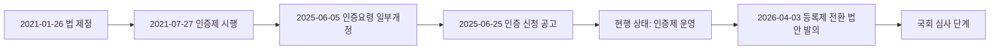
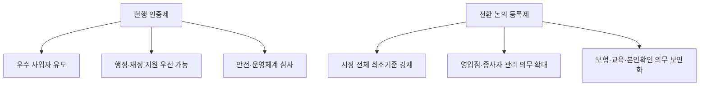

Creator: member-delta
Created: 2026-07-29 17:33
Version: 1.0

# 시각자료 개요
- 본 시각자료는 현행 인증제와 등록제 전환 논의를 혼동하지 않도록 `제도 상태`, `정책 흐름`, `주요 일정`을 한 화면에서 구분하는 데 초점을 둔다.
- 모든 내용은 alpha 분석 보고서에 포함된 날짜와 제도 요소만 재구성했다.
- 출처 기준: `output/소화물-인증-등록제/member-alpha/analysis-report.md`, `output/소화물-인증-등록제/member-gamma/fact-check-log.md`

# Mermaid 다이어그램
현행 제도와 입법 논의 단계를 분리한 흐름도

정책 목적의 변화 비교도

# 핵심 수치 테이블
| 항목 | 수치/일자 | 의미 |
|------|-----------|------|
| 법 공포일 | 2021-01-26 | 인증제 법적 근거 출발점 |
| 인증 기준 시행일 | 2021-07-27 | 현행 제도 운영 시작 |
| 인증요령 일부개정 | 2025-06-05 | 최근 제도 정비 시점 |
| 인증 신청 공고 | 2025-06-25 | 현재도 인증 신청 체계 유지 |
| 등록제 전환 법안 발의 | 2026-04-03 | 등록제는 입법 제안 단계 |
| 소관위 회부 | 2026-04-06 | 국회 심사 진행 흔적 |

출처 메모: 규제정보포털, 국가물류통합정보센터, 국민참여입법센터, 한국교통연구원 자료를 alpha 분석 보고서가 정리한 값을 그대로 사용했다.
