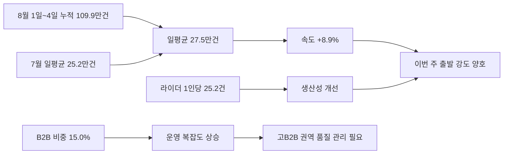
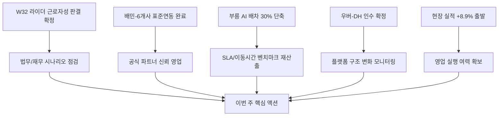

# 이번 바로고 현장 배송 실적과 최근 배달 플랫폼 업계 동향

**작성일**: 2026-08-05
**Task Type**: research-report
**활성 멤버**: alpha(조사) · gamma(팩트체크) · delta(시각화) · beta(보고서)
**사이클**: 1 / 3
**승인**: human_approval=false (AUTO 모드 자동 완료)

## 요약

- 이번 주 기준 최신 현장 배송 스냅샷(`2026-08-01`~`2026-08-04`)은 7월 평균 대비 `일평균 처리량 +8.9%`, `B2B 비중 +0.7%p`, `라이더 1인당 처리량 +3.1건`으로 출발이 좋다.
- 실적 가속의 중심은 `바로고 본 브랜드(57.2%)`이며, 전국 물량은 `경기`, `경남`, `서울`, `전남`, `경북` 상위 5개 권역에 `63.5%`가 집중돼 있다.
- 다만 최근 업계 뉴스는 바로고에 우호적인 규제 프레임보다 `배달대행사 직접 노무 리스크`를 더 크게 만들고 있다.
- 동시에 배민-배달대행 6개사 위치추적 표준연동 완료는 바로고가 대외 영업에 바로 쓸 수 있는 드문 신뢰 신호다.
- 따라서 이번 주 우선순위는 `실적 모니터링` 그 자체보다 `근로자성 리스크 점검`, `표준연동 영업화`, `AI 배차 벤치마크 재산출` 3가지다.

## 현장 실적 요약

### 이번 주 기준선과 해석 방식

- 현장 대시보드는 주간 모드가 아니라 월누적 스냅샷을 제공하므로, 이번 보고서는 `2026-08-01`~`2026-08-04` 누적치를 `이번 주 기준 최신 스냅샷`으로 해석했다.
- 비교 기준은 `2026-07-01`~`2026-07-31` 전체월 실적이며, 총량이 아닌 `일평균`, `B2B 비중`, `라이더 1인당 처리량`으로 정규화했다.
- 원문 출처:
  - `https://crm.ax.barogo.io/api/external/dashboard?date=2026-08-05&ym=2026-08`
  - `https://crm.ax.barogo.io/api/external/dashboard?date=2026-07-31&ym=2026-07`

### 핵심 수치

| 지표 | 8월 1일~4일 | 7월 평균 기준 | 해석 |
|---|---:|---:|---|
| 전체 건수 | 1,099,163건 | 252,280건/일 | 현재 일평균 `274,791건`, `+8.9%` |
| B2B 비중 | 15.0% | 14.2% | `+0.7%p`, 운영 복잡도 상승 |
| 라이더 1인당 처리량 | 25.2건 | 22.1건 | `+3.1건`, 생산성 개선 |

### 실적 해석

- `바로고`는 현재 누적 `629,107건`으로 전체의 `57.2%`를 차지하며, 7월 평균 대비 브랜드 일평균 가속 폭도 가장 컸다(`+10.3%`).
- 상위 5개 권역 집중도는 `63.5%`로 유지되고 있어, 전국 평균보다 `경기/경남/서울` 중심의 실행 상태가 더 중요하다.
- `서울`, `대구`, `광주`는 B2B 비중이 각각 `29.9%`, `31.1%`, `29.9%`로 높아 `볼륨`보다 `품질/SLA` 관리 난도가 더 높다.
- 이번 주 운영 포인트는 `대형 권역 물량 유지`와 `고B2B 권역 품질 유지`를 동시에 보는 것이다.

## 업계 동향

### 1. 이번 주 뉴스 프레임은 `배달앱 규제 수혜`가 아니라 `배달대행사 직접 리스크`다

- `W31` 리포트는 공정위 과징금 심의와 플랫폼 규제 강화를 배경으로 바로고를 `규제 안전지대의 독립 B2B 배달대행`으로 해석했다.
- 그러나 `W32` 리포트는 라이더 근로자성 판결 최종 확정의 직접 피고가 `배달대행 플랫폼업체`라고 명시하면서, 바로고와 동일 사업구조 리스크를 전면에 올렸다.
- 따라서 한 주 만에 외부 프레임이 `상대적 수혜 가능성`에서 `직접 방어 필요`로 이동했다.

### 2. 같은 주에 배민 표준연동은 영업 기회가 됐다

- `W32` 원문은 배민이 `바로고`, `딜버`, `젠딜리`, `생각대로`, `래티브`, `부릉`과 위치추적 표준연동을 완료했다고 적고 있다.
- 이는 배민 기술 규격 종속이라는 의미도 있지만, 외부 고객에게는 `검증된 공식 연동 파트너`라는 신뢰 신호이기도 하다.
- 현재 현장 실적이 양호한 만큼, 이번 주에는 이 사실을 `공식 파트너/신뢰성` 영업 메시지로 전환하는 편이 실익이 크다.

### 3. 경쟁 기준은 정성 설명에서 정량 공개 벤치마크로 이동 중이다

- `W32`는 부릉 AI 배차가 이동시간을 `12.7분 -> 9.2분`, `30% 단축`했다고 소개한다.
- 또한 `배달대행비 -40% vs 배달앱 이용료 +40.9~59%` 데이터가 기사화되면서, 비용 메시지도 더 정량적으로 비교되는 흐름이 강해졌다.
- 앞으로는 바로고 역시 `평균 이동시간`, `도착 정시율`, `비용 구조 비교표`처럼 숫자로 설명해야 하는 환경이 강화될 가능성이 높다.

### 참고 출처

- `https://barogo-intel.vercel.app/api/report?week=2026-W32&locale=kr`
- `https://barogo-intel.vercel.app/api/report?week=2026-W31&locale=kr`
- `https://barogo-intel.vercel.app/api/archive/search?weekFrom=2026-W20&weekTo=2026-W32&locale=kr`
- `https://barogo-intel.vercel.app/api/keywords?locale=kr`

## 시각 요약

현장 실적이 어떤 신호로 읽혀야 하는지 한눈에 정리

업계 뉴스가 이번 주 우선순위를 어떻게 바꾸는지 정리

| 축 | 핵심 숫자 | 이번 주 해석 |
|---|---|---|
| 현장 볼륨 | 일평균 `274,791건` | 7월 평균 대비 `+8.9%`로 양호한 출발 |
| 운영 복잡도 | B2B 비중 `15.0%` | 7월 대비 `+0.7%p`, 고B2B 권역 관리 중요 |
| 브랜드 중심성 | 바로고 `57.2%` | 본 브랜드 가속이 전체 개선 주도 |
| 외부 리스크 | 라이더 근로자성 판결 확정 | 배달대행사 직접 리스크 관리 우선 |
| 외부 기회 | 배민 표준연동 6개사 참여 | 영업용 신뢰 메시지 전환 가능 |

## 추천 사항

1. `법무/재무`: 이번 주 안에 라이더 계약 구조와 근로자성 판결 기준을 대조하고 비용 충격 3개 시나리오를 작성한다.
   근거: `W32`에서 리스크가 `배달앱`이 아니라 `배달대행 플랫폼업체` 직접 이슈로 전환됐다.

2. `영업/현장`: 배민 표준연동 참여 사실을 `공식 파트너 신뢰` 메시지로 바꾼 1장짜리 영업 자료를 즉시 배포한다.
   근거: 바로고 이름이 공개적으로 포함된 드문 기사 근거가 생겼고, 현재 현장 실적도 이를 뒷받침한다.

3. `운영/프로덕트`: 부릉이 공개한 지표와 같은 기준으로 바로고의 평균 이동시간, 도착 정시율, SLA 개선폭을 재산출한다.
   근거: 경쟁 기준이 정성 설명에서 정량 비교로 이동하고 있다.

4. `경영관리`: 이번 주 실적 모니터링은 `전국 총량`보다 `상위 5개 권역 볼륨`, `서울/대구/광주 B2B 품질`, `바로고 본 브랜드 가속 지속 여부`를 우선 지표로 본다.
   근거: 집중 구조와 복잡도 상승이 동시에 나타나고 있기 때문이다.
