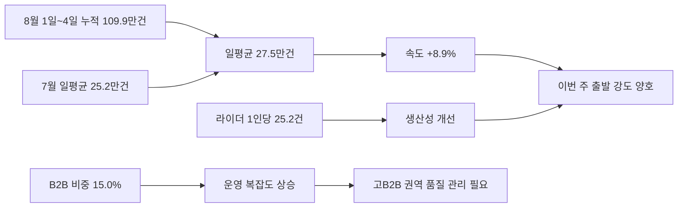
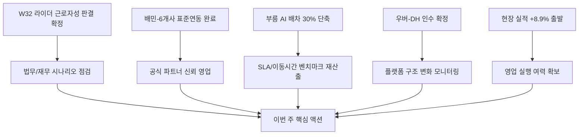

Creator: member-delta
Created: 2026-08-05 14:10
Version: 1.0

# 시각자료 개요

- 시각화 대상 1: 이번 주 기준 현장 배송 실적의 진단 흐름
- 시각화 대상 2: 최근 업계 뉴스가 바로고 의사결정으로 이어지는 흐름
- 수치 출처: `output/이번-바로고-현장-배송-실적이랑/member-alpha/analysis-report.md`

# Mermaid 다이어그램

현장 실적이 어떤 신호로 읽혀야 하는지 한눈에 정리

업계 뉴스가 이번 주 우선순위를 어떻게 바꾸는지 정리

# 핵심 수치 테이블

## 전국 핵심 지표 비교

| 지표 | 8월 1일~4일 | 7월 전체 | 비교 해석 |
|---|---:|---:|---|
| 전체 건수 | 1,099,163건 | 7,820,669건 | 총량 직접 비교 대신 일평균 비교 필요 |
| 일평균 처리량 | 274,791건 | 252,280건 | `+8.9%` |
| B2B 비중 | 15.0% | 14.2% | `+0.7%p` |
| 라이더 1인당 처리량 | 25.2건 | 22.1건 | `+3.1건` |

## 브랜드별 현재 비중과 속도 변화

| 브랜드 | 현재 누적 건수 | 현재 비중 | 7월 대비 일평균 속도 변화 |
|---|---:|---:|---:|
| 바로고 | 629,107건 | 57.2% | +10.3% |
| 딜버 | 270,864건 | 24.6% | +6.8% |
| 모아라인 | 194,901건 | 17.7% | +8.2% |

## 상위 권역 핵심 포인트

| 권역 | 현재 누적 건수 | 현재 비중 | 7월 대비 일평균 속도 변화 | 현재 B2B 비중 |
|---|---:|---:|---:|---:|
| 경기 | 269,019건 | 24.5% | +9.1% | 18.7% |
| 경남 | 158,353건 | 14.4% | +10.2% | 9.6% |
| 서울 | 102,451건 | 9.3% | +8.9% | 29.9% |
| 전남 | 89,923건 | 8.2% | +9.0% | 12.6% |
| 경북 | 77,867건 | 7.1% | +7.4% | 7.5% |

## 뉴스 기반 경영 시그널

| 뉴스 신호 | 확인 근거 | 바로고 함의 |
|---|---|---|
| 라이더 근로자성 판결 확정 | `W32` | 배달대행사 직접 노무 리스크 |
| 배민-6개사 표준연동 완료 | `W32` | 영업용 신뢰 메시지 전환 기회 |
| 우버-DH 148억달러 인수 확정 | `W32` | 중장기 플랫폼 구조 변화 추적 |
| 부릉 AI 배차 30% 단축 | `W32` | 내부 SLA/배차 성능 재벤치마크 필요 |
