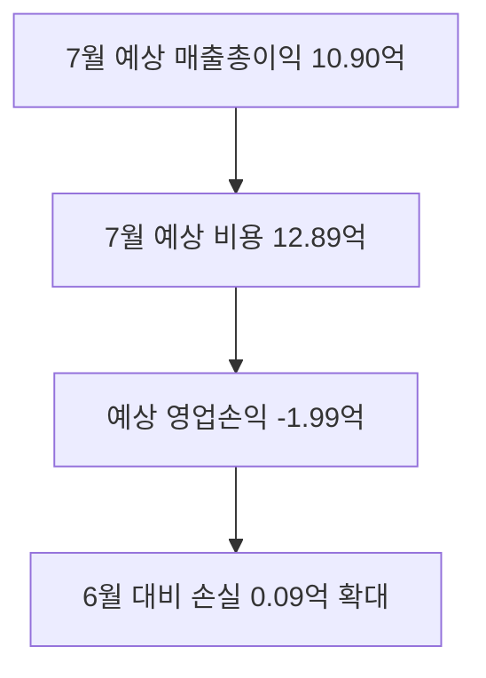

# 2026-07 전사 경영 실적(손익) 요약

**작성일**: 2026-07-31
**Task Type**: mgmt-planning
**활성 멤버**: alpha · delta · beta
**사이클**: 3 / 3
**승인**: human_approval override (사내 대시보드 데이터 사용) - Notion 저장은 자동 진행, Slack 등 나머지 외부 배포는 승인 대기 알림만 발송

## 요약
- ERP 기준 `2026-07` 전사 예상 영업손익은 `-199,283,982원`이다.
- 6월 확정치 대비 손실이 `9,282,074원` 확대됐고, 손익률은 `85.4%`에서 `84.5%`로 `0.9%p` 하락했다.
- 핵심 관리 대상은 `통합물류`, `브랜드물류`, `4륜사업`이며, `채널비즈니스`는 적자 폭이 축소됐다.

## 핵심 실적
| 구분 | 7월 예상 | 7월 실적(30일 누적) | 6월 확정 | 전월 대비 |
|---|---:|---:|---:|---|
| 매출총이익 | 1,089,679,282 | 1,054,528,337 | 1,107,290,098 | -17,610,816 |
| 비용 | 1,288,963,264 | 1,247,383,804 | 1,297,292,006 | -8,328,742 |
| 영업손익 | -199,283,982 | -192,855,467 | -190,001,908 | -9,282,074 |
| 손익률 | 84.5% | 84.5% | 85.4% | -0.9%p |

- 30/31일 누적 실적과 월말 예상치의 차이는 영업손실 기준 `6,428,515원`이다.
- 월말 하루 변동 여지는 남아 있지만, 현재 방향성은 `적자 지속`으로 유지된다.

## 사업부별 손익 포인트
| 사업부 | 7월 영업손익 | 6월 영업손익 | 증감 | 판단 |
|---|---:|---:|---:|---|
| 통합물류 | -91,150,719 | -89,984,697 | -1,166,022 | 절대 손실 최대, 단기 방어 1순위 |
| 브랜드물류 | -66,749,771 | -64,774,413 | -1,975,358 | 브랜드 부문 수익성 추가 약화 |
| 4륜사업 | -37,925,454 | -25,284,542 | -12,640,912 | 악화 폭 최대, 원인 분리 점검 필요 |
| 채널비즈니스 | -3,458,039 | -9,958,256 | 6,500,217 | 적자 축소, 개선 흐름 유지 필요 |

- 주석: 사업부 표는 ERP 응답의 정수 표시값을 사용했고, 전사 총계는 소수점 총계(`-199,283,982.4`)를 반올림해 표기했다. 이 때문에 사업부 합계와 `1원` 차이가 있다.
- `통합물류`와 `브랜드물류`가 전사 적자의 대부분을 차지한다.
- `4륜사업`은 손실 절대액보다 악화 속도가 더 큰 문제다.
- `통합물류`와 `브랜드물류`의 합산 손실은 `-157,900,490원`으로 집중 관리 대상이 명확하다.
- `컨택센터`, `공통개발센터`는 재배부 비용 풀이라 영업손익 `0` 으로 해석된다.

## 비용 구조 및 리스크
| 비용 항목 | 7월 금액 | 메모 |
|---|---:|---|
| 사업인건비 | 400,537,838 | 직접비 최대 비중 |
| 개발인건비 | 291,366,249 | 고정성 원가 부담 지속 |
| Infra | 179,522,708 | 운영비 비중 높음 |
| 사업지원 | 85,819,915 | 공통 지원비 |
| 내부거래 | 170,457,712 | 배부 구조 영향 큼 |

- 비용 감소 폭보다 매출총이익 감소 폭이 더 커 `마진 방어 실패`가 핵심 원인이다.
- 공통비와 내부거래 비중이 높아, 사업부 단독 개선만으로는 전사 손실 축소 폭이 제한될 수 있다.
- 7월 값은 ERP의 `예상` 값이므로 월말 확정치와 일부 차이가 있을 수 있으나, 30일 누적 실적까지 반영된 현재 시점에서도 방향성은 `적자 지속`으로 명확하다.
- 본 문서는 사내 대시보드에서 취득한 민감 재무 데이터를 포함하므로 Notion(사내 지식베이스) 저장만 자동 허용되고, Slack 최종 공유 등 나머지 외부 배포는 사람 승인 전까지 보류한다.

## 추천 사항
1. `물류BU장`은 `2026-08-01 12:00`까지 `통합물류`와 `브랜드물류`의 상위 마진 훼손 항목 5개를 제출하고, 두 사업부 합산 손실을 최소 `10,000,000원` 줄이는 실행안을 경영회의 안건으로 상정한다.
2. `4륜사업 책임자`는 `2026-08-01 EOD`까지 전월 대비 `12,640,912원` 악화분을 `물량`, `단가`, `일회성 비용`으로 분해한 브리지 자료를 제출해 구조적 손실 여부를 판정한다.
3. `재무팀`은 `2026-07-31 마감 후` 최종 확정 전까지 `30/31일 누적 실적`과 `월말 예상`의 차이(`6,428,515원`)를 재산출하고, 차이가 `5,000,000원`을 넘으면 경영진에게 당일 재보고한다.
4. `경영기획`은 `2026-08-02`까지 `사업지원`, `공통비1~3`, `내부거래`를 포함한 공통비 재배부 구조를 점검하고, 8월부터 즉시 집행 가능한 간접비 절감 항목과 목표 금액을 제시한다.
