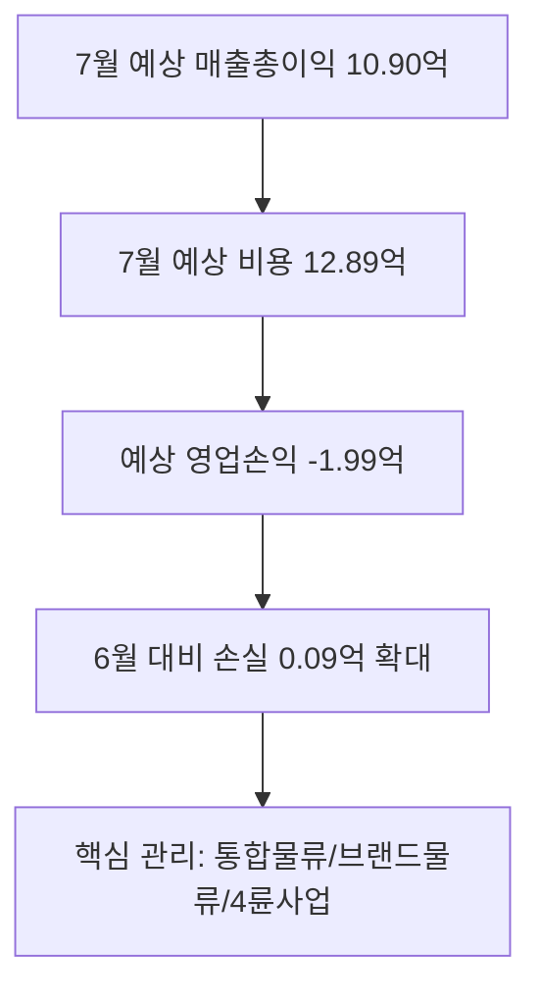
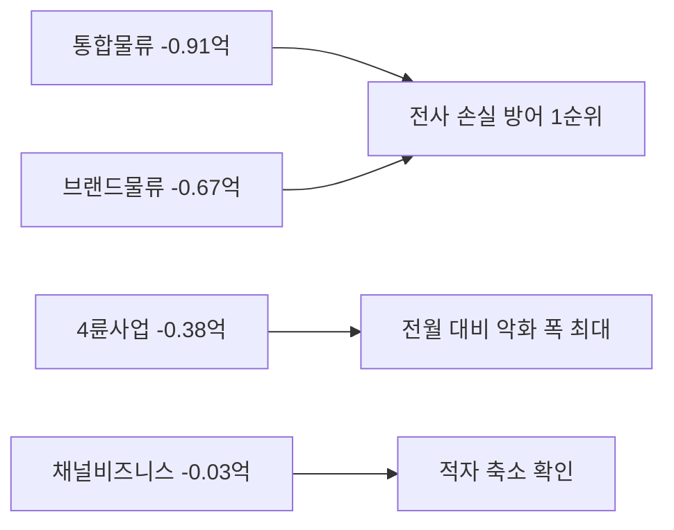

Creator: member-delta
Created: 2026-07-30 16:08
Updated: 2026-07-31 13:44
Version: 3.0

# 경영 실적 요약 시각자료

## 시각자료 개요
- 목적: 2026년 7월 전사 손익의 현재 수준, 전월 대비 변화, 사업부별 관리 포인트를 경영진이 한 화면에서 파악할 수 있게 정리.
- 전제: ERP 기준 7월 값은 `예상`, 7월 실적은 `30/31일 누적`, 6월 값은 `확정` 이다.

## Mermaid 다이어그램
전사 손익 흐름 요약

월말 잔여 1일 보정 포인트

사업부별 관리 우선순위

## 핵심 수치 테이블
| 구분 | 7월 예상 | 7월 실적(30일) | 6월 확정 | 해석 |
|---|---:|---:|---:|---|
| 매출총이익 | 1,089,679,282 | 1,054,528,337 | 1,107,290,098 | 전월 대비 1.59% 감소 |
| 비용 | 1,288,963,264 | 1,247,383,804 | 1,297,292,006 | 전월 대비 0.64% 감소 |
| 영업손익 | -199,283,982 | -192,855,467 | -190,001,908 | 손실 9,282,074원 확대 |
| 손익률 | 84.5% | 84.5% | 85.4% | 0.9%p 하락 |

| 사업부 | 7월 영업손익 | 전월 대비 | 메모 |
|---|---:|---:|---|
| 통합물류 | -91,150,719 | -1,166,022 | 절대 손실 최대 |
| 브랜드물류 | -66,749,771 | -1,975,358 | 핵심 수익성 약화 |
| 4륜사업 | -37,925,454 | -12,640,912 | 악화 폭 최대 |
| 채널비즈니스 | -3,458,039 | 6,500,217 | 적자 축소 |

- 주석: 사업부 영업손익은 ERP 응답의 정수 표시값이며, 전사 영업손익은 소수점 총계(`-199,283,982.4`) 반올림값이라 합계와 `1원` 차이날 수 있다.
