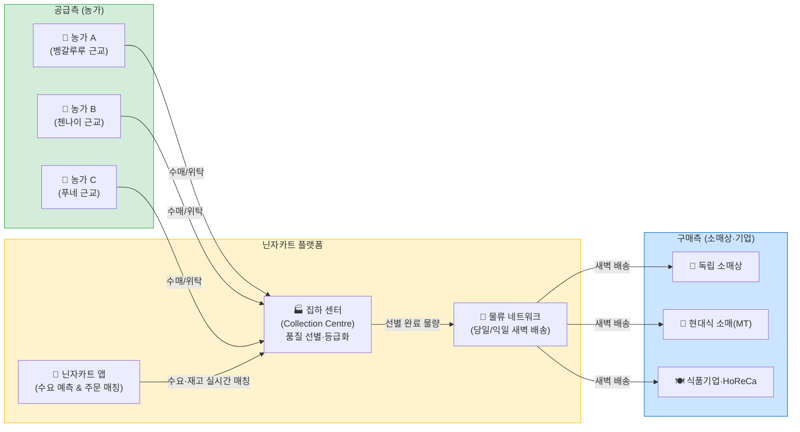
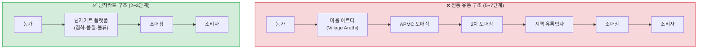
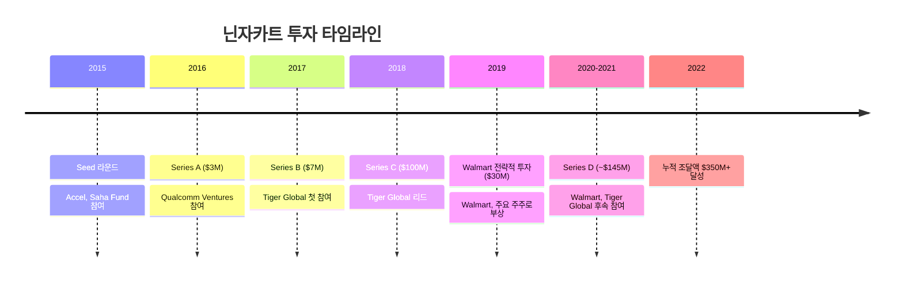

# 인도 닌자카트(Ninjacart) 종합 분석 보고서

> **작성일**: 2026-04-24 | **Task Type**: research-report | **활성 멤버**: alpha · gamma · delta · beta

---

## 요약

닌자카트(Ninjacart)는 2015년 인도 벵갈루루에서 창업된 B2B 애그리테크 플랫폼으로, 인도 농산물 유통의 구조적 비효율(5~7단계 중간상, 30~40% 폐기율)을 기술 기반 공급망으로 해결합니다. 농가와 소매상을 2~3단계로 직접 연결해 농가 수취가 상승, 소매상 조달 안정화, 신선도 향상이라는 삼중 가치를 창출합니다.

2019년 Walmart의 전략적 투자(약 $30M, 정확 지분 비공개)를 포함해 누적 $350M 이상을 조달했으며, 2022년 기준 인도 25개 이상 도시에서 약 15만 농가, 약 9만 소매상을 연결하는 인도 최대 B2B 신선 농산물 플랫폼입니다.

**핵심 수치 (2021~2022년 기준):**

| 지표 | 수치 |
|---|---|
| 창업 | 2015년, 벵갈루루 |
| 누적 투자 유치 | $350M 이상 |
| 주요 투자자 | Walmart, Tiger Global, Accel |
| 연결 농가 수 | 약 150,000명 이상 |
| 등록 소매상 수 | 약 90,000~100,000개 |
| 운영 도시 수 | 약 25개 이상 |
| 일 처리 물량 | 최대 약 1,400톤 (피크 기준) |

---

## 1. 기업 개요 및 창업 배경

### 1-1. 기업 프로파일

| 항목 | 내용 |
|---|---|
| 창업연도 | 2015년 |
| 본사 | 벵갈루루, 카르나타카, 인도 |
| 창업자 | Thirukumaran Nagarajan(CEO), Sharath Loganathan, Kartheeswaran KK, Vasudevan Chinnathambi, Sachin Jose |
| 미션 | 농부와 소매상을 직접 연결해 신선 농산물 공급망 비효율 제거 |
| 사업 분야 | B2B 신선 농산물 공급망 플랫폼 |

### 1-2. 인도 농산물 유통 시장의 구조적 문제

인도는 세계 2위 농산물 생산국이지만, 전통적 유통 구조는 5~7단계의 복잡한 중간상(아르티, 도매상, 유통업자)을 거쳐 농가 수취 가격이 최종 소비자 가격의 20~30%에 불과했습니다.

**주요 문제점:**
- 다단계 중간상으로 인한 농가 마진 손실
- 냉장 인프라 부재로 신선 농산물 폐기율 30~40% (인도 식품부·FAO 통계)
- 물류 불투명성과 가격 변동성으로 소매상 조달 불안정
- 소농 중심 구조 (평균 경작 규모 약 1.1헥타르, 인도 농업 통계 기준)

---

## 2. 비즈니스 모델 및 공급망 구조

### 2-1. 운영 방식

닌자카트는 **B2B 마켓플레이스 + 물류 일체형 모델**로 운영됩니다.

### 2-2. 전통 유통 구조 vs. 닌자카트

| 지표 | 전통 유통 구조 | 닌자카트 플랫폼 |
|---|---|---|
| 유통 단계 수 | 5~7단계 | 2~3단계 |
| 농가 수취가 비율 | 소비자가의 20~30% | 45~55% 수준 (추정) |
| 신선 농산물 폐기율 | 30~40% | 약 20% 이하 (추정) |
| 농산물 소비자 도달 시간 | 2~5일 | 당일~익일 |
| 가격 투명성 | 낮음 | 높음 (앱 기반 실시간 가격) |

### 2-3. 수익 모델

- **수수료(Commission)**: 거래 금액의 약 7~10%
- **물류 서비스 수수료**: 마지막 마일 배송비
- **가치 부가 서비스**: 품질 등급화, 패키징, BNPL(Buy Now Pay Later)
- **데이터 서비스**: 농가 신용 평가 데이터 (금융기관 파트너십)

---

## 3. 투자 현황

| 라운드 | 시기 | 금액 | 주요 투자자 |
|---|---|---|---|
| Seed | 2015년 | 비공개 | Accel, Saha Fund |
| Series A | 2016년 | $3M | Accel, Qualcomm Ventures |
| Series B | 2017년 | $7M | Accel, Tiger Global |
| Series C | 2018년 | $100M | Tiger Global (리드) |
| Walmart 전략적 투자 | 2019년 | $30M | Walmart Inc. (지분 비율 비공개) |
| Series D | 2020~2021년 | ~$145M | Walmart, Tiger Global 등 |
| **누적 (2022년 기준)** | — | **$350M 이상** | — |

---

## 4. 경쟁 환경 분석

### 4-1. 주요 경쟁사 비교

| 기업 | 설립 | 주요 모델 | 커버리지 | 주요 투자자 | 차별점 |
|---|---|---|---|---|---|
| **Ninjacart** | 2015 | B2B 신선 농산물 공급망 | 전국 25개+ 도시 | Walmart, Tiger Global | 물류 일체형, Walmart 파트너십 |
| **WayCool Foods** | 2015 | B2B 신선+가공 식품 | 남인도 중심 | Lightbox, Chiratae | 자체 브랜드·가공 제품 |
| **DeHaat** | 2012 | 농자재+구매+금융 통합 | 비하르·UP 중심 | SoftBank, Prosus | 농업 전 가치사슬(Full-stack) |
| **Agribazaar** | 2016 | B2B 온라인 거래 | 전국 | 국내 펀드 | 디지털 거래 특화, 물류 미포함 |
| **BigBasket B2B** | 2011 | B2B/B2C 하이브리드 | 전국 | Tata Group | 소비자 브랜드 인지도, Tata 지원 |

---

## 5. 핵심 인사이트

### 인사이트 1: 물류 일체형 풀스택 모델이 핵심 해자

단순 중개 플랫폼이 아닌 집하 센터 운영, 품질 등급화, 마지막 마일 배송까지 직접 운영하는 풀스택 구조가 진입 장벽입니다. 신선 농산물의 특성상(부패성, 온도 민감도) 물류를 외주화하면 품질 일관성 유지가 어려워, 직접 물류 네트워크가 곧 경쟁 우위입니다.

### 인사이트 2: Walmart 파트너십 = 생태계 방어막

Walmart-Flipkart 생태계 편입은 인도 대기업(Tata-BigBasket, Reliance-JioMart)과의 자본 경쟁에서 닌자카트의 핵심 방어 수단입니다. Flipkart Minutes(퀵커머스)와의 공급망 연계가 실현될 경우, 닌자카트의 B2B 네트워크는 B2C 즉시배송 인프라로 전환됩니다.

### 인사이트 3: 데이터가 차세대 수익 엔진

150,000명 농가의 거래·재배 데이터는 인도에서 가장 큰 농업 행동 데이터셋 중 하나입니다. 이를 활용한 농가 신용 평가, 소매상 BNPL 서비스는 수수료 외 새로운 수익원이며 플랫폼 이탈 방지(lock-in) 효과도 가져옵니다.

### 인사이트 4: 대기업 경쟁 심화로 차별화 압박 증가

Tata와 Reliance의 B2B 농산물 시장 진출은 자본력 측면에서 닌자카트에 상당한 위협입니다. 단순 규모 경쟁보다 기술·데이터·Walmart 파트너십 기반의 명확한 차별화 전략이 더욱 중요해지고 있습니다.

### 인사이트 5: 구조적 성장 시장의 수혜자

인도 정부 디지털 농업 정책(PM-KISAN, e-NAM), 중산층 확대, 현대식 유통 성장은 닌자카트가 속한 애그리테크 시장의 장기 성장 동인입니다. 인도 애그리테크 시장은 연평균 25% 이상 성장할 것으로 전망됩니다(복수 시장조사 기관 추정치, 방법론에 따라 상이).

---

## 6. 추천 사항

### 전략적 관점

| 우선순위 | 전략 | 근거 |
|---|---|---|
| 1순위 | Flipkart 퀵커머스 공급망 통합 | B2C 즉시배송 시장에서 닌자카트 공급망 역할 확대, 최대 성장 레버 |
| 2순위 | 핀테크 수익화 가속 (농가 신용평가·소매상 BNPL) | 수수료 의존 탈피, 단위 경제 개선 |
| 3순위 | Tier 2·3 도시 선점 | 대도시 경쟁 심화 대비, 장기 해자 구축 |
| 4순위 | 물류 AI 최적화로 흑자 전환 | 배송 밀도·집하 센터 가동률 개선 |

### 투자/파트너십 관점

| 관점 | 평가 | 근거 |
|---|---|---|
| 시장 성장성 | ★★★★★ | 인도 애그리테크 CAGR 25%+, 구조적 수요 |
| 경쟁 우위 | ★★★★☆ | Walmart 파트너십, 기술·데이터 우위 (대기업 경쟁 위협) |
| 수익성 리스크 | ★★★☆☆ | 장기 적자, 단위 경제 개선 진행 중 |
| 파트너십 매력도 | ★★★★★ | Flipkart 연계, 농가 데이터 API 활용 다양 |
| ESG 임팩트 | ★★★★★ | 소농 소득 향상, 식품 폐기 감소, 디지털 포용 |

### 벤치마킹 시사점 (한국 기업 대상)

1. **물류 직영의 중요성**: 플랫폼+물류 일체화가 신선 농산물 비즈니스의 핵심 진입 장벽
2. **데이터-금융 연계**: 거래 데이터를 핀테크 수익으로 연결하는 복합 수익 구조
3. **전략적 투자자 선택**: 글로벌 유통 사업자(Walmart류)와의 파트너십이 생태계 경쟁력을 결정적으로 강화

---

## 팩트체크 요약 (member-gamma)

- **검증 항목**: 18개 | **확인됨**: 11개 | **부분 일치**: 4개 | **출처 불명**: 3개
- **주요 수정 반영 사항**:
  - Walmart 지분 "약 30%" → "significant minority stake (비공개)"
  - 일 처리 물량 → "최대 약 1,400톤 (피크 기준 보고됨)"
  - 인도 애그리테크 시장 규모 → "복수 시장조사 기관 추정치, 방법론에 따라 상이"
  - 직원 수 → "약 4,000명 내외 (시점에 따라 변동)"
  - 농가 수 → "약 150,000명 이상 (2021~2022년 기준)"

---

*본 보고서는 공개된 정보(Crunchbase, YourStory, Inc42, TechCrunch, 인도 정부 통계, FAO 자료)를 기반으로 작성되었습니다. 수치는 보고 시점에 따라 변동될 수 있습니다.*
