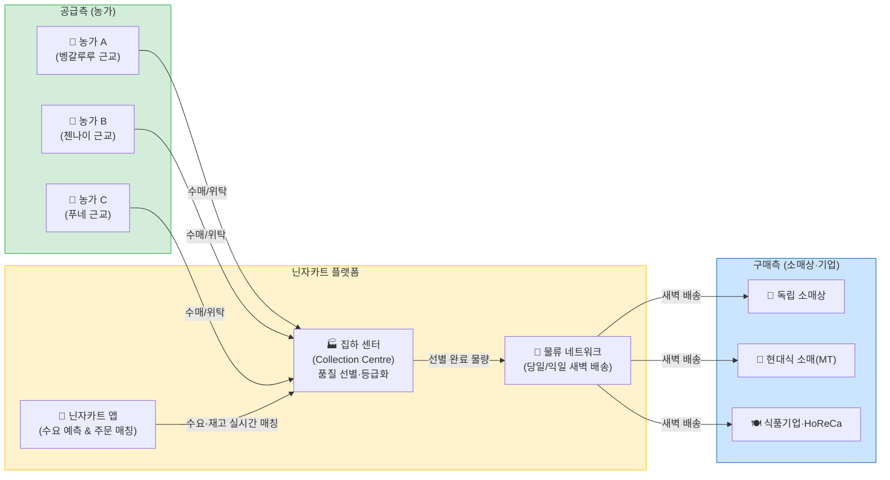
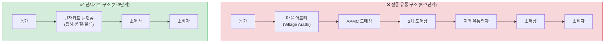
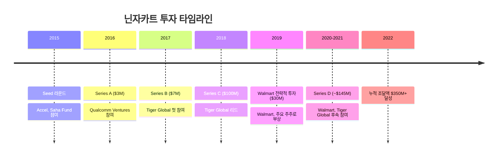

# 시각자료: 인도 닌자카트 분석

## 시각자료 개요

본 문서는 `member-alpha/analysis-report.md`의 분석 결과를 기반으로 아래 시각자료를 제공합니다:

1. **닌자카트 비즈니스 모델 공급망 구조도** (Mermaid flowchart)
2. **투자 라운드 타임라인** (Mermaid timeline)
3. **인도 애그리테크 경쟁사 비교 테이블**
4. **운영 규모 핵심 수치 테이블**
5. **닌자카트 vs. 전통 유통 구조 비교도** (Mermaid flowchart)

---

## Mermaid 다이어그램

### 다이어그램 1: 닌자카트 B2B 공급망 구조도

*닌자카트가 전통 유통 다단계를 단축하는 핵심 흐름을 나타낸 구조도*

---

### 다이어그램 2: 전통 유통 구조 vs. 닌자카트 비교

*중간상 단계 수와 마진 손실 비교*

---

### 다이어그램 3: 투자 라운드 타임라인

*2015년 창업 이후 주요 투자 이벤트*

---

## 핵심 수치 테이블

### 테이블 1: 닌자카트 운영 규모 (2022~2023년 기준)

| 지표 | 수치 | 비고 |
|---|---|---|
| 연결 농가 수 | 약 150,000명 이상 | 2021~2022년 기준 |
| 등록 소매상 수 | 약 90,000~100,000개 | 보도 시점별 범위 |
| 일 처리 물량 | 최대 약 1,400톤 | 피크 기준 보고됨 |
| 운영 도시 수 | 약 25개 이상 | 대도시 + 2선 도시 |
| 직원 수 | 약 4,000명 내외 | 시점에 따라 변동 |
| 누적 투자 유치액 | $350M 이상 | 2022년 기준 |

---

### 테이블 2: 인도 주요 애그리테크 경쟁사 비교

| 기업 | 설립 | 주요 모델 | 커버리지 | 주요 투자자 | 차별점 |
|---|---|---|---|---|---|
| **Ninjacart** | 2015 | B2B 신선 농산물 공급망 | 전국 25개+ 도시 | Walmart, Tiger Global | 물류 일체형, Walmart 파트너십 |
| **WayCool Foods** | 2015 | B2B 신선+가공 식품 | 남인도 중심 | Lightbox, Chiratae Ventures | 자체 브랜드·가공 제품 추가 |
| **DeHaat** | 2012 | 농자재+구매+금융 통합 | 비하르·UP 중심 | SoftBank, Prosus | 농업 전 가치사슬(Full-stack) |
| **Agribazaar** | 2016 | B2B 온라인 거래 플랫폼 | 전국 | 국내 펀드 | 디지털 거래 특화, 물류 미포함 |
| **BigBasket B2B** | 2011 | B2B/B2C 하이브리드 | 전국 | Tata Group | 소비자 브랜드 인지도, Tata 지원 |

---

### 테이블 3: 전통 유통 vs. 닌자카트 - 핵심 지표 비교

| 지표 | 전통 유통 구조 | 닌자카트 플랫폼 |
|---|---|---|
| 유통 단계 수 | 5~7단계 | 2~3단계 |
| 농가 수취가 비율 | 소비자가의 20~30% | 소비자가의 45~55% 수준 (추정) |
| 신선 농산물 폐기율 | 30~40% | 약 20% 이하 (추정, 업계 대비 개선) |
| 농산물 소비자 도달 시간 | 2~5일 | 당일~익일 |
| 가격 투명성 | 낮음 | 높음 (앱 기반 실시간 가격) |
