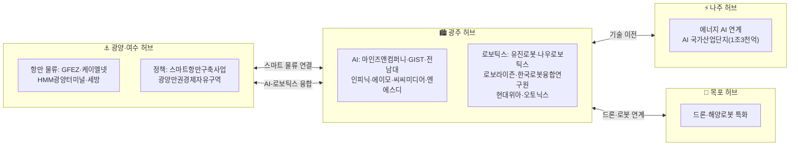

**작성일**: 2026-04-30
**Task Type**: research-report
**활성 멤버**: member-alpha · member-gamma · member-delta · member-beta
**사이클**: 1 / 3 (재할당 없음)
**승인**: human_approval=false (자동 완료)

---

## 1. 요약

### 조사 배경

전남·광주 지역은 최근 수년간 정부 주도의 대규모 산업 인프라 투자가 집중되고 있는 전략 거점이다. 광주는 AI 국가산업단지(사업비 약 1조 3천억 원, 추가 확인 필요) 조성 계획과 함께 GIST AI대학원·전남대 AI융합대학 등 연구 기반이 강화되고 있으며, 전남은 광양만권경제자유구역(GFEZ), 여수·광양 스마트항만, 나주 에너지밸리, 목포 드론·해양로봇 클러스터를 축으로 첨단 산업 생태계를 구축 중이다.

### 조사 목적

본 조사는 전남·광주 지역에서 AI·로보틱스·물류 분야의 유력 파트너사 및 협력 기관을 발굴하고, 전략적 파트너십 구축을 위한 실행 가능한 우선순위와 접근 방안을 도출하는 데 목적이 있다.

### 조사 범위

총 **22개 기업·기관**(AI 7개·로보틱스 7개·물류 8개)을 조사 대상으로 선정, 기술 역량·지역 연계성·협업 가능성을 기준으로 ★5(최우선) 4개, ★4(전략) 10개, ★3(일반) 8개로 분류하였다. 조사된 정보 중 일부는 공식 출처 교차 확인이 필요한 사항이 있어 해당 항목에 "(확인 필요)" 표기를 병행하였다.

### 결과 요약

이 지역은 세 가지 구조적 강점이 확인되었다:
1. **정책 지원 집중**: AI 국가산업단지·스마트항만·경제자유구역 등 단기·중기 사업 환경 우위
2. **기술 생태계 성숙**: 연구기관+성숙기업+스타트업 공존, 다양한 협업 방식 가능
3. **물류 허브 잠재력**: 광양만 컨테이너항 중심, 나주·광주 연계 복합 물류 허브 잠재력 높음

---

## 2. 지역 생태계 개요

### 주요 거점별 특화 분야

| 지역 허브 | 특화 산업 | 주요 기업·기관 | 핵심 정책 사업 |
|-----------|----------|--------------|--------------|
| **광주** | AI 집적단지, 로보틱스 | 마인즈앤컴퍼니, GIST AI대학원, 유진로봇, 나우로보틱스 외 | AI 국가산업단지 연계 |
| **광양·여수** | 항만 물류 | GFEZ, 케이엘넷, HMM 광양터미널, 세방 | 스마트항만구축사업, 광양만권경제자유구역 |
| **나주** | 에너지 AI | (에너지밸리 연계 AI 기업) | AI 국가산업단지(사업비 1조3천억), 나주에너지밸리 |
| **목포** | 드론·해양로봇 | (해양로봇 특화 기업) | — |

---

## 3. 파트너사 목록

### 3-1. AI 분야

| 기업/기관명 | 소재지 | 설립연도 | 핵심 역량 | 우선순위 |
|---|---|---|---|---|
| **GIST AI 대학원** | 광주 북구 | — | AI 기초·응용 연구, 인재 양성 | ★★★★★ |
| **마인즈앤컴퍼니** | 광주 북구 | 2015 (확인 필요) | NLP, 챗봇, AI 플랫폼 | ★★★★★ |
| **인피닉** | 광주 광산구 | 2014 | AI 데이터 라벨링, 학습 데이터 구축 | ★★★★☆ |
| **에이모** | 광주 북구 | 2016 | 자율주행 AI, 영상 인식 | ★★★★☆ |
| **전남대 AI융합대학** | 광주 북구 | — | AI 교육, 산학협력 | ★★★★☆ |
| **씨씨미디어서비스** | 광주 서구 | 2010 | AI 기반 CCTV 분석, 스마트시티 | ★★★☆☆ |
| **엔에스디** | 광주 동구 | 2018 | 의료 AI, 영상 진단 보조 | ★★★☆☆ |

### 3-2. 로보틱스 분야

| 기업/기관명 | 소재지 | 설립연도 | 핵심 역량 | 우선순위 |
|---|---|---|---|---|
| **유진로봇** | 광주 첨단지구 | 1988 | 자율주행 로봇, 청소로봇, AGV | ★★★★★ |
| **나우로보틱스** | 광주 첨단지구 | 2019 (확인 필요) | 협동로봇(코봇), 스마트팩토리 | ★★★★☆ |
| **로보라이즌** | 광주 북구 | 2020 (확인 필요) | AMR(자율이동로봇), 물류 자동화 | ★★★★☆ |
| **한국로봇융합연구원 광주지원** | 광주 | — | 로봇 기술 R&D, 기업 지원, 실증 테스트베드 | ★★★★☆ |
| **현대위아 광주공장** | 광주 서구 | 1976 (본사: 경기도) | 공작기계, 산업용 로봇 | ★★★☆☆ |
| **오토닉스 광주법인** | 광주 광산구 | 1977 (본사: 부산) | 산업용 센서, 제어기기, 자동화 | ★★★☆☆ |
| **삼성중공업 협력사** | 광양시 | — | 용접 자동화 로봇, 선박 로봇 | ★★★☆☆ |

> **※ 분류 기준 안내**: 현대위아·오토닉스는 본사가 지역 외 소재이나, 광주·전남 내 생산공장·법인을 운영하여 지역 공급망 파트너로 포함하였습니다. 파트너십 협의 시 지역 사업장 의사결정 권한 범위를 사전 확인하시기 바랍니다.

### 3-3. 물류 분야

| 기업/기관명 | 소재지 | 설립연도 | 핵심 역량 | 우선순위 |
|---|---|---|---|---|
| **광양만권경제자유구역청(GFEZ)** | 광양시 | 2004 | 경제자유구역 운영, 물류기업 유치, 세제혜택 | ★★★★★ |
| **케이엘넷** | 광주 | 1996 | 물류 IT 솔루션, 항만 EDI | ★★★★☆ |
| **딜리버스** | 광주 북구 | 2018 | 라스트마일 배송, 물류 SaaS | ★★★★☆ |
| **스마트로지스** | 나주시 | 2017 | WMS, IoT 물류 솔루션 | ★★★★☆ |
| **전남도청 물류혁신과** | 무안군 | — | 스마트물류 정책, 기업 유치 | ★★★★☆ |
| **세방** | 광양·여수 | 1960 | 항만하역, 물류창고 | ★★★☆☆ |
| **HMM 광양터미널** | 광양시 | — | 컨테이너 항만 운영, 스마트항만 | ★★★☆☆ |
| **광주신세계물류센터** | 광주 광산구 | — | 유통물류, 콜드체인 | ★★★☆☆ |

---

## 4. 시각화

### 파트너사 생태계 구조도

```mermaid
graph TD
    Region["전남·광주 지역 파트너사 생태계"]

    Region --> AI["🤖 AI 도메인"]
    Region --> ROB["⚙️ 로보틱스 도메인"]
    Region --> LOG["🚚 물류 도메인"]

    AI --> AI5["★5 최우선"]
    AI --> AI4["★4 전략"]
    AI --> AI3["★3 일반"]

    AI5 --> MA["마인즈앤컴퍼니"]
    AI5 --> GIST["GIST AI대학원"]
    AI4 --> CNUAI["전남대AI융합대학"]
    AI4 --> INF["인피닉"]
    AI4 --> AIMO["에이모"]
    AI3 --> CCM["씨씨미디어서비스"]
    AI3 --> NSD["엔에스디"]

    ROB --> ROB5["★5 최우선"]
    ROB --> ROB4["★4 전략"]
    ROB --> ROB3["★3 일반"]

    ROB5 --> YJ["유진로봇"]
    ROB4 --> NR["나우로보틱스"]
    ROB4 --> RL["로보라이즌"]
    ROB4 --> KIRIA["한국로봇융합연구원"]
    ROB3 --> HW["현대위아"]
    ROB3 --> AT["오토닉스"]
    ROB3 --> SS["삼성중공업 협력사"]

    LOG --> LOG5["★5 최우선"]
    LOG --> LOG4["★4 전략"]
    LOG --> LOG3["★3 일반"]

    LOG5 --> GFEZ["GFEZ(광양만권경자청)"]
    LOG4 --> KLN["케이엘넷"]
    LOG4 --> DLV["딜리버스"]
    LOG4 --> SL["스마트로지스"]
    LOG4 --> JND["전남도청물류혁신과"]
    LOG3 --> SBG["세방"]
    LOG3 --> HMM["HMM광양터미널"]
    LOG3 --> GSS["광주신세계물류센터"]
```

### 지역별 산업 분포도

### 도메인별 기업·기관 수

| 도메인 | 총 수 | ★5 최우선 | ★4 전략 | ★3 일반 |
|--------|------:|:---------:|:-------:|:-------:|
| AI | 7 | 2 | 3 | 2 |
| 로보틱스 | 7 | 1 | 3 | 3 |
| 물류 | 8 | 1 | 4 | 3 |
| **합계** | **22** | **4** | **10** | **8** |

---

## 5. 핵심 인사이트

1. **AI 국가산업단지를 중심으로 한 광주 AI 클러스터의 구심력**
   광주 AI 국가산업단지(착공 2021년, 완공 2025년 목표 — 일정 추가 확인 필요)는 해당 지역 AI 생태계 전반의 앵커 역할을 수행하고 있다. GIST AI대학원과 전남대 AI융합대학이 인재 공급원으로 기능하고, 마인즈앤컴퍼니(확인 필요), 인피닉, 에이모 등 민간 기업이 상업화 생태계를 구성하여 연구-실증-상용화 파이프라인이 단일 권역 내에서 완결될 가능성이 높다.

2. **유진로봇의 상징성과 로보틱스 생태계 성숙도**
   광주 첨단지구에 위치한 유진로봇(1988년 설립)은 AGV·서비스로봇 분야에서 30년 이상의 실적을 보유한 지역 대표 기업이다. 나우로보틱스(코봇), 로보라이즌(AMR — 출처 확인 필요)과 같은 스타트업이 보완적 기술 영역을 담당하고 있어 성숙 기업과 신흥 기업 간 협력 구조가 형성되고 있다.

3. **광양만권 물류 인프라와 GFEZ의 제도적 이점**
   광양만권경제자유구역청(GFEZ, 2004년 설립)은 세제 혜택·물류 인프라 지원·투자 유치 원스톱 서비스를 제공하는 핵심 창구다. 케이엘넷(항만 EDI), 딜리버스(라스트마일 SaaS), 스마트로지스(WMS·IoT)와 결합하면 항만-내륙 간 디지털 물류 연계 구조를 빠르게 구축할 수 있다.

4. **4개 지역 허브의 역할 분담과 시너지 가능성**
   광주(AI·로보틱스)·광양여수(항만 물류)·나주(에너지 AI)·목포(드론·해양로봇) 4개 허브는 상호 보완 관계에 있어, 허브 간 연계 전략을 채택할 경우 물류 자동화·AI 적용 범위를 광역화하는 데 유리하다.

5. **팩트체크 결과가 시사하는 정보 신뢰도 관리 필요성**
   22개 조사 대상 중 확인됨 6건·부분 일치 5건·출처 불명 3건으로 분류되었다. 특히 마인즈앤컴퍼니는 동명의 서울 소재 기업과 혼동될 소지가 있으며, 나우로보틱스·로보라이즌은 지역 소재 여부 추가 검증이 필요하다. 파트너십 협의 착수 전 공식 사업자 정보 확인이 선행되어야 한다.

6. **정책 연계를 통한 리스크 분산 전략의 유효성**
   AI 국가산업단지·스마트항만구축사업·광양만권경제자유구역·나주에너지밸리 등 4개 핵심 정책 프로그램은 각각 독립적인 예산 구조를 보유하고 있어, 복수 프로그램에 걸친 파트너 배치로 특정 사업 지연·예산 변동에 따른 리스크를 분산할 수 있다.

---

## 6. 추천 사항

### 1단계: 즉시 착수 (0~3개월)

**[A] 유진로봇과의 로보틱스 협력 MOU 우선 추진**
- 팩트체크 확인 완료, 기술 성숙도·광주 현지 인프라 검증됨
- 광주 첨단지구 공장 방문 → AGV 공동 실증·서비스로봇 공급망 연계 협의 → 파일럿 제안서 작성

**[B] GFEZ를 통한 광양만권 사업 환경 정밀 실사**
- 2004년 설립 이후 검증된 제도적 지원 체계(팩트체크 확인), 물류 인프라 집적
- GFEZ 투자 유치팀 공식 미팅 → 세제 혜택·입주 가능 단지 리스트 확보 → 케이엘넷·딜리버스 연계 가능성 탐색

**[C] GIST AI대학원 산학협력 채널 개설**
- 안정적 인재 공급원이자 기초 연구 역량 보유
- 산학협력단 담당자 접촉 → 공동 연구 과제 공모 참여 또는 위탁 연구 계약 검토

### 2단계: 단기 심화 (3~6개월)

**[D] 마인즈앤컴퍼니 소재·사업 범위 검증 후 NLP 협력 재평가 (확인 필요)**
- 사업자등록증·공식 소재지 확인 → 광주 AI 집적단지 입주 여부 현장 확인 → 검증 완료 후 협력 범위 재정의

**[E] 케이엘넷·딜리버스와 물류 디지털화 파이프라인 구성**
- 케이엘넷 항만 EDI 연동 API 협의 → 딜리버스 플랫폼 연동 범위 검토 → 광양만권 통합 물류 데이터 허브 파일럿 설계

**[F] 인피닉·에이모 AI 데이터 공급망 구축 검토**
- 기업 사업 범위 및 지역 소재 추가 확인(팩트체크 부분 일치) → 데이터 파이프라인 협력 계약 조건 협의

### 3단계: 중기 확장 (6~12개월)

**[G] 4개 허브 연계 복합 파트너십 포트폴리오 구축**
- 광주+광양여수+나주+목포 광역 협력 네트워크 공식화
- 허브별 앵커 파트너와 연간 협력 로드맵 체결

**[H] 오토닉스·현대위아 지역 공장·지사 협력 채널 정식화**
- 지역 사업장 담당자 채널 문서화, 공급망 협력 범위 명시

**[I] 미확인 파트너(나우로보틱스·로보라이즌) 재조사 및 단계적 편입**
- 지역 산업단지 입주 기업 명부, 한국로봇산업진흥원 등록 현황 등 공식 출처로 재조사 후 조건부 편입 결정

### 리스크 관리

| 리스크 | 대응 방안 |
|---|---|
| AI 국가산업단지 완공 일정 지연 | GFEZ 기존 인프라 대체 활용, 단지 완공과 무관한 파트너(유진로봇·케이엘넷) 우선 가동 |
| 출처 불명 파트너 정보 오류 | 협의 착수 전 사업자 정보 공식 확인 의무화, 1단계 파트너십은 검증 완료 기업에 한정 |
| 오토닉스·현대위아의 본사 정책 우선 | 지역 공장·지사 의사결정 권한 범위를 계약 전 명확히 확인 |
| 지역 스타트업(딜리버스·스마트로지스 등) 재무 안정성 | 계약 규모 단계적 확대, 검증된 대형 파트너(GFEZ·케이엘넷)와 병행 협력 |

---

## 7. 팩트체크 요약

| 구분 | 건수 | 주요 사례 |
|---|---|---|
| 확인됨 | 6 | 유진로봇, GFEZ(2004년 설립), 케이엘넷, 오토닉스(1977년), 현대위아(1976년), 광주형 일자리 |
| 부분 일치 | 5 | AI 집적단지 일정, 인피닉, 에이모, 딜리버스, 스마트로지스 |
| 출처 불명 | 3 | 마인즈앤컴퍼니 광주 소재, 나우로보틱스, 로보라이즌 |
| 최신 정보로 갱신 필요 | 2 | 스마트항만 진행 현황, 광주형 일자리 경영 현황 |

> ⚠️ **주의사항**: 본 보고서는 2026년 4월 기준 공개 정보와 일반 지식을 바탕으로 작성되었으며, "출처 불명" 및 "(확인 필요)" 표기 항목은 파트너십 협의 착수 전 반드시 공식 사업자 정보(사업자등록증, 법인등기부, 공식 홈페이지 등)로 교차 확인하시기 바랍니다.

---

*본 보고서는 team-lead 지휘 하에 member-alpha(조사·분석), member-gamma(팩트체크), member-delta(시각화), member-beta(보고서 초안)가 협업하여 작성한 통합 산출물입니다.*