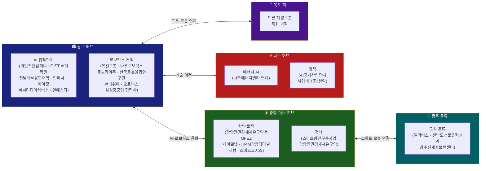
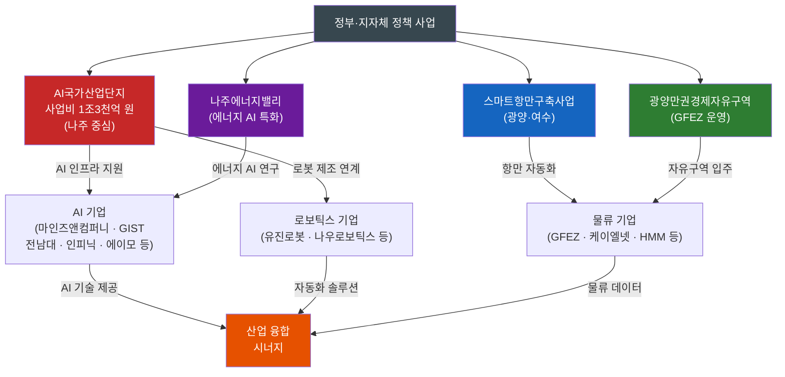

# 전남·광주 지역 AI·로보틱스·물류 파트너사 시각화

## 시각자료 개요

본 문서는 member-alpha의 분석 보고서를 바탕으로 전남·광주 지역의 AI·로보틱스·물류 파트너사 생태계를 시각화한 자료입니다.

- **대상 도메인**: AI, 로보틱스, 물류
- **총 기업·기관 수**: 22개 (AI 7개 · 로보틱스 7개 · 물류 8개)
- **주요 허브 지역**: 광주, 광양·여수, 나주, 목포
- **핵심 정책 사업**: AI국가산업단지(1조3천억), 스마트항만구축사업, 광양만권경제자유구역, 나주에너지밸리

---

## Mermaid 다이어그램

### 다이어그램 1: 파트너사 생태계 구조도

```mermaid
graph TD
    Region["전남·광주 지역 파트너사 생태계"]

    Region --> AI["🤖 AI 도메인"]
    Region --> ROB["⚙️ 로보틱스 도메인"]
    Region --> LOG["🚚 물류 도메인"]

    AI --> AI5["★5 우선순위"]
    AI --> AI4["★4 우선순위"]
    AI --> AI3["★3 우선순위"]

    AI5 --> MA["마인즈앤컴퍼니"]
    AI5 --> GIST["GIST AI대학원"]
    AI4 --> CNUAI["전남대AI융합대학"]
    AI4 --> INF["인피닉"]
    AI4 --> AIMO["에이모"]
    AI3 --> CCM["씨씨미디어서비스"]
    AI3 --> NSD["엔에스디"]

    ROB --> ROB5["★5 우선순위"]
    ROB --> ROB4["★4 우선순위"]
    ROB --> ROB3["★3 우선순위"]

    ROB5 --> YJ["유진로봇"]
    ROB4 --> NR["나우로보틱스"]
    ROB4 --> RL["로보라이즌"]
    ROB4 --> KIRIA["한국로봇융합연구원"]
    ROB3 --> HW["현대위아"]
    ROB3 --> AT["오토닉스"]
    ROB3 --> SS["삼성중공업 협력사"]

    LOG --> LOG5["★5 우선순위"]
    LOG --> LOG4["★4 우선순위"]
    LOG --> LOG3["★3 우선순위"]

    LOG5 --> GFEZ["광양만권경제자유구역청(GFEZ)"]
    LOG4 --> KLN["케이엘넷"]
    LOG4 --> DLV["딜리버스"]
    LOG4 --> SL["스마트로지스"]
    LOG4 --> JND["전남도청물류혁신과"]
    LOG3 --> SBG["세방"]
    LOG3 --> HMM["HMM광양터미널"]
    LOG3 --> GSS["광주신세계물류센터"]

    style Region fill:#1a1a2e,color:#ffffff
    style AI fill:#16213e,color:#e0e0e0
    style ROB fill:#0f3460,color:#e0e0e0
    style LOG fill:#533483,color:#e0e0e0
    style AI5 fill:#e94560,color:#ffffff
    style ROB5 fill:#e94560,color:#ffffff
    style LOG5 fill:#e94560,color:#ffffff
    style AI4 fill:#f5a623,color:#000000
    style ROB4 fill:#f5a623,color:#000000
    style LOG4 fill:#f5a623,color:#000000
    style AI3 fill:#7ed321,color:#000000
    style ROB3 fill:#7ed321,color:#000000
    style LOG3 fill:#7ed321,color:#000000
```

**[캡션]** 전남·광주 지역 3개 도메인(AI·로보틱스·물류)의 22개 파트너사·기관을 우선순위(★5~★3)별로 계층화한 생태계 구조도. 붉은색(★5)이 최우선 협력 대상, 주황(★4)이 전략적 파트너, 녹색(★3)이 일반 협력 후보를 나타냄.

---

### 다이어그램 2: 지역별 산업 분포도

**[캡션]** 전남·광주 4개 주요 허브(광주·광양여수·나주·목포)의 산업 특화 분포와 허브 간 연계 구조. 광주는 AI·로보틱스 양대 거점, 광양·여수는 항만 물류, 나주는 에너지 AI, 목포는 드론·해양로봇에 특화되어 있으며, 상호 연계를 통해 광역 생태계를 구성함.

---

### 다이어그램 3: 정책 사업 연계 구조도

**[캡션]** 4개 핵심 정책 사업(AI국가산업단지·스마트항만구축사업·광양만권경제자유구역·나주에너지밸리)이 AI·로보틱스·물류 기업군과 연결되어 산업 융합 시너지를 창출하는 정책-산업 연계 구조도.

---

## 핵심 수치 테이블

### 테이블 1: 도메인별 기업·기관 수

| 도메인 | 총 수 | ★5 (최우선) | ★4 (전략) | ★3 (일반) |
|--------|------:|:-----------:|:---------:|:---------:|
| AI | 7 | 2 | 3 | 2 |
| 로보틱스 | 7 | 1 | 3 | 3 |
| 물류 | 8 | 1 | 4 | 3 |
| **합계** | **22** | **4** | **10** | **8** |

---

### 테이블 2: 우선순위별 기업 상세 분류

| 우선순위 | 도메인 | 기업·기관명 |
|----------|--------|------------|
| ★5 | AI | 마인즈앤컴퍼니, GIST AI대학원 |
| ★5 | 로보틱스 | 유진로봇 |
| ★5 | 물류 | 광양만권경제자유구역청(GFEZ) |
| ★4 | AI | 전남대AI융합대학, 인피닉, 에이모 |
| ★4 | 로보틱스 | 나우로보틱스, 로보라이즌, 한국로봇융합연구원 |
| ★4 | 물류 | 케이엘넷, 딜리버스, 스마트로지스, 전남도청물류혁신과 |
| ★3 | AI | 씨씨미디어서비스, 엔에스디 |
| ★3 | 로보틱스 | 현대위아, 오토닉스, 삼성중공업 협력사 |
| ★3 | 물류 | 세방, HMM광양터미널, 광주신세계물류센터 |

---

### 테이블 3: 지역별 산업 특화 현황

| 지역 허브 | 특화 산업 | 주요 기업·기관 | 핵심 정책 사업 |
|-----------|----------|--------------|--------------|
| 광주 | AI 집적단지, 로보틱스 | 마인즈앤컴퍼니, GIST AI대학원, 유진로봇, 나우로보틱스 외 | AI국가산업단지 연계 |
| 광양·여수 | 항만 물류 | GFEZ, 케이엘넷, HMM광양터미널, 세방 | 스마트항만구축사업, 광양만권경제자유구역 |
| 나주 | 에너지 AI | (에너지밸리 연계 AI 기업) | AI국가산업단지(사업비 1조3천억), 나주에너지밸리 |
| 목포 | 드론·해양로봇 | (해양로봇 특화 기업) | - |

---

### 테이블 4: 핵심 정책 사업 요약

| 정책 사업명 | 소관 지역 | 사업 규모 | 주요 연계 도메인 |
|------------|---------|---------|--------------|
| AI국가산업단지 | 나주 (광주 연계) | 사업비 1조3천억 원 | AI, 로보틱스 |
| 스마트항만구축사업 | 광양·여수 | - | 물류 |
| 광양만권경제자유구역 | 광양 | - | 물류 |
| 나주에너지밸리 | 나주 | - | AI (에너지 특화) |

> ※ "-" 는 원본 분석 보고서에 구체적 수치가 명시되지 않은 항목입니다.
