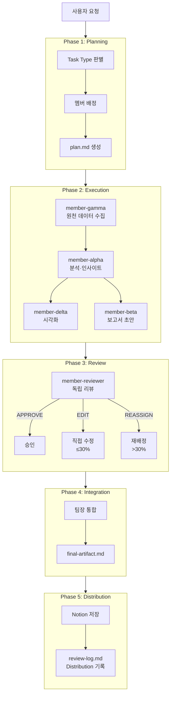
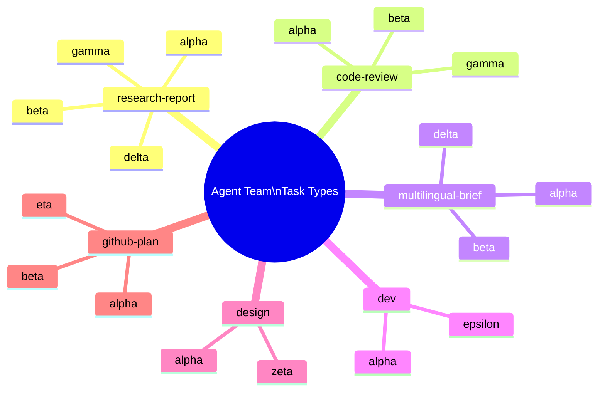
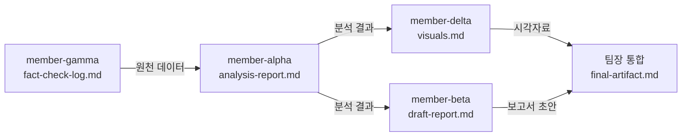

# Claude Code Agent Team 멀티에이전트 시스템 분석 보고서

**워크스페이스**: 테스트  
**생성일**: 2026-05-26  
**Task Type**: research-report  
**참여 멤버**: member-gamma · member-alpha · member-delta · member-beta

---

## 요약

Claude Code Agent Team은 팀장 1명과 7명의 전문 멤버로 구성된 멀티에이전트 오케스트레이션 프레임워크다. 6가지 task type에 따라 필요한 멤버만 동적으로 활성화하는 구조를 갖추며, 파일 기반 핸드오프와 역할 격리 원칙을 통해 아티팩트 품질과 재현성을 확보한다.

이번 테스트 실행을 통해 research-report 타입의 4단계 파이프라인(gamma → alpha → delta → beta)이 정상 작동함을 확인했다.

| 지표 | 결과 |
|---|---|
| 총 Phase 수 | 5개 (Planning·Execution·Review·Integration·Distribution) |
| 활성 멤버 수 | 4명 (gamma·alpha·delta·beta) |
| 생성된 산출물 수 | 4개 |
| AUTO 모드 인터럽트 포인트 | 8개 (전 자동 처리) |
| 외부 데이터 수집 | WebSearch 비허용 → 내부 문서 fallback |

---

## 시스템 구조

### 계층 구조

Agent Team은 **팀장(Team Lead) 1명 + 전문 멤버 7명**의 2계층 구조로 구성된다.

- **팀장 계층**: Planning → Execution → Review → Integration → Distribution 전체 오케스트레이션
- **멤버 계층**: 역할별 전문화 (리서치·분석·팩트체크·시각화·개발·설계·GitHub 탐색)

### 전체 파이프라인 흐름

### Task Type별 활성 멤버

| Task Type | 활성 멤버 수 | 핵심 산출물 | Default |
|---|---|---|---|
| research-report | 4명 (alpha·beta·gamma·delta) | analysis-report + draft-report + visuals | ✅ |
| code-review | 3명 (alpha·gamma·beta) | analysis-report + fact-check-log + draft-report | ✗ |
| multilingual-brief | 3명 (alpha·beta·delta) | analysis-report + draft-report + visuals | ✗ |
| dev | 2명 (alpha·epsilon) | analysis-report + dev-log + diff-summary | ✗ |
| design | 2명 (alpha·zeta) | analysis-report + design-spec | ✗ |
| github-plan | 3명 (eta·alpha·beta) | github-research-report + analysis-report + draft-report | ✗ |

### research-report 타입 멤버 의존성

---

## 운영 메커니즘

### Workspace Protocol

- 슬러그 기반 폴더 분리(`output/{topic-slug}/`)로 주제별 아티팩트 격리
- `.active-workspace` 파일로 현재 활성 슬러그 단일 관리
- `새 작업` 키워드 트리거로 새 워크스페이스 자동 생성

### AUTO 모드 인터럽트 처리 (8개 포인트)

| 포인트 | 내용 | 자동 처리 방식 |
|---|---|---|
| ① 슬러그 확인 | 워크스페이스 슬러그 확정 | 자동 확정 |
| ② 재사용 여부 | 기존 리서치 재사용 판단 | 30일+80% 기준 자동 판단 |
| ③ Task Type | 동점 처리 | 나열 순서 기준 자동 선택 |
| ④ Phase 3 리뷰 | 직접수정 기준 완화 | 30% 이하 EDIT, 초과 REASSIGN |
| ⑤ Phase 4 재실행 | 품질 미충족 시 | max_cycles 이내 자동 재실행 |
| ⑥ human_approval | 승인 게이트 | 자동 승인 |
| ⑦ 에스컬레이션 | 파일 없음·감지 실패 | POST /report → 계속 진행 |
| ⑧ Phase 5 | Distribution 실행 | enabled 엔드포인트 즉시 실행 |

### Termination 파라미터

| 파라미터 | 값 |
|---|---|
| max_cycles | 3 |
| max_review_per_member | 2 |
| human_approval | false |
| review_direct_edit_threshold | 30% |

---

## 핵심 인사이트

1. **역할 격리가 품질의 핵심**: 팀장은 오케스트레이션만, 멤버는 도메인 내 작업만 — 아티팩트 오염 방지와 독립 리뷰를 실현.
2. **alpha가 SPOF**: 6개 task type 전부에 alpha 참여 — 병목 및 단일 장애점 위험.
3. **AUTO 모드로 완전 무인화**: Slack/API 트리거 + 8개 자동 처리 포인트 → 야간 자동 파이프라인 가능.
4. **파일 기반 핸드오프로 낮은 결합도**: 멤버 간 직접 통신 없음 → 재실행·교체 영향 최소화.
5. **문서 불일치 리스크**: CLAUDE.md 20% vs team-config.yaml 30% 불일치 → 실운영 혼선 가능.

---

## 강점 vs 개선 영역

| 구분 | 항목 | 영향도 |
|---|---|---|
| 강점 | 역할 격리 원칙 | 높음 |
| 강점 | 파일 기반 핸드오프 | 높음 |
| 강점 | AUTO 모드 완전 무인화 | 높음 |
| 강점 | Task Type 동적 팀 구성 | 중간 |
| 강점 | 품질 3단계 검증 | 중간 |
| 개선 | alpha 단일 의존도 | 높음 |
| 개선 | direct_edit_threshold 불일치 | 낮음 |
| 개선 | WebSearch 환경 의존성 | 중간 |
| 개선 | AGENT.md 정기 감사 부재 | 낮음 |

---

## 추천 사항

### 단기 (즉시 적용)

1. **direct_edit_threshold 통일**: CLAUDE.md `20%` → `30%` 수정 (또는 team-config.yaml을 20%로 통일)
2. **WebSearch fallback 문서화**: gamma AGENT.md에 내부 문서 fallback 조항 추가
3. **epsilon·zeta·eta AGENT.md 일관성 감사**: 미확인 3개 멤버 파일 포맷 검토

### 중기 (다음 스프린트)

4. **alpha 병렬화 또는 역할 세분화**: alpha-code / alpha-research 분리 또는 병렬 인스턴스 지원
5. **Gmail/Drive 연동 활성화**: 인증 후 배포 채널 다양화
6. **AGENT.md 정기 감사 자동화**: github-plan type + member-eta를 활용한 자동 검사 루틴 구축

---

## Distribution 현황

| 엔드포인트 | 상태 |
|---|---|
| Notion | ✅ 활성 (Phase 5에서 저장 예정) |
| Gmail | ❌ 비활성 |
| Google Drive | ❌ 비활성 |
| Google Calendar | ❌ 비활성 |

---

*통합 완료: 2026-05-26 | 전체 멤버 APPROVE | human_approval: false → 자동 승인*
