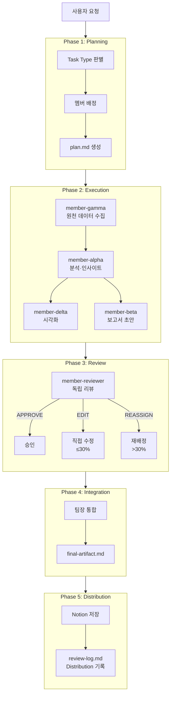
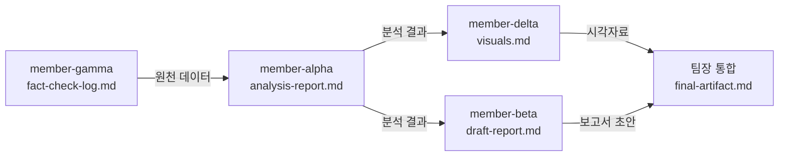
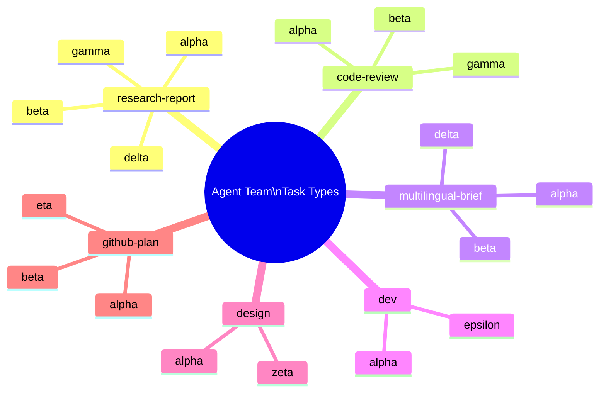

# 시각자료: Claude Code Agent Team 멀티에이전트 시스템

---

## 시각자료 개요

| 자료 번호 | 유형 | 제목 | 출처 데이터 |
|---|---|---|---|
| V-01 | Mermaid flowchart | 전체 파이프라인 Phase 흐름 | alpha analysis-report §2 |
| V-02 | Mermaid graph | 멤버 의존성 맵 (research-report 타입) | alpha analysis-report §1.3 |
| V-03 | Mermaid mindmap | Task Type별 활성 멤버 구조 | alpha analysis-report §1.2 |
| V-04 | 비교 테이블 | Task Type 요약 | alpha analysis-report §1.2 |
| V-05 | 비교 테이블 | 강점 vs 개선 영역 | alpha analysis-report §3~4 |

---

## Mermaid 다이어그램

### V-01: 전체 파이프라인 Phase 흐름

팀장이 수행하는 5개 Phase와 각 단계 산출물의 흐름을 나타낸다.

### V-02: 멤버 의존성 맵 (research-report 타입)

research-report 타입에서 멤버 간 데이터 흐름과 의존 관계를 나타낸다.

### V-03: Task Type별 활성 멤버 구조

6개 task type 각각의 활성 멤버 조합을 나타낸다.

---

## 핵심 수치 테이블

### T-01: Task Type 요약

| Task Type | 활성 멤버 수 | 핵심 산출물 | Default |
|---|---|---|---|
| research-report | 4명 (alpha·beta·gamma·delta) | analysis-report + draft-report + visuals | ✅ |
| code-review | 3명 (alpha·gamma·beta) | analysis-report + fact-check-log + draft-report | ✗ |
| multilingual-brief | 3명 (alpha·beta·delta) | analysis-report + draft-report + visuals | ✗ |
| dev | 2명 (alpha·epsilon) | analysis-report + dev-log + diff-summary | ✗ |
| design | 2명 (alpha·zeta) | analysis-report + design-spec | ✗ |
| github-plan | 3명 (eta·alpha·beta) | github-research-report + analysis-report + draft-report | ✗ |

### T-02: Termination 파라미터

| 파라미터 | 값 | 의미 |
|---|---|---|
| max_cycles | 3 | 최대 실행 사이클 수 |
| max_review_per_member | 2 | 멤버당 최대 리뷰 횟수 |
| human_approval | false | 자동 승인 (사용자 확인 불필요) |
| auto_proceed_on_escalation | true | 에스컬레이션 시 자동 계속 진행 |
| review_direct_edit_threshold | 30% | 직접 수정 가능 최대 변경량 |

### T-03: Distribution 엔드포인트 현황

| 엔드포인트 | 상태 | 비고 |
|---|---|---|
| Notion | ✅ 활성 | data_source_id: 348363ae-... |
| Gmail | ❌ 비활성 | 인증 후 활성화 예정 |
| Google Drive | ❌ 비활성 | 인증 후 활성화 예정 |
| Google Calendar | ❌ 비활성 | 인증 후 활성화 예정 |

### T-04: 강점 vs 개선 영역 요약

| 구분 | 항목 | 영향도 |
|---|---|---|
| 강점 | 역할 격리 원칙 | 높음 |
| 강점 | 파일 기반 핸드오프 | 높음 |
| 강점 | AUTO 모드 완전 무인화 | 높음 |
| 강점 | Task Type 동적 팀 구성 | 중간 |
| 강점 | 품질 3단계 검증 | 중간 |
| 개선 | alpha 단일 의존도 | 높음 |
| 개선 | direct_edit_threshold 불일치 | 낮음 |
| 개선 | WebSearch 환경 의존성 | 중간 |
| 개선 | AGENT.md 정기 감사 부재 | 낮음 |
