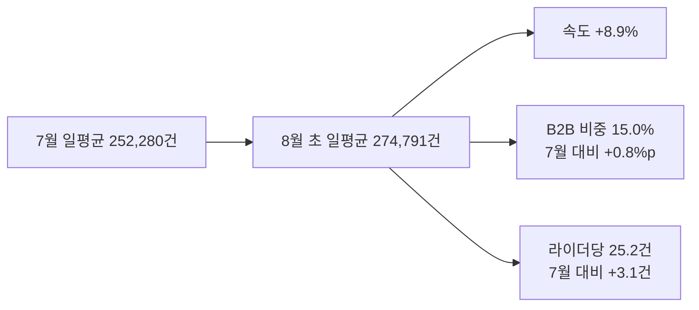
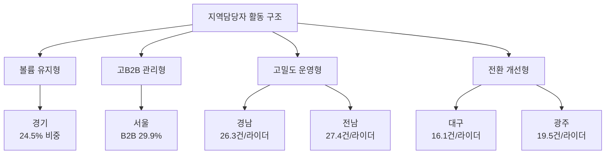

# 현장 지역담당자 최근 영업활동 현황 분석

**작성일**: 2026-08-05
**Task Type**: research-report
**활성 멤버**: alpha(조사) · gamma(팩트체크) · delta(시각화) · beta(보고서)
**사이클**: 1 / 3
**승인**: human_approval=false (AUTO 모드 자동 완료, dashboard override 비활성)

## 요약

- 산출 기준: 현장 대시보드 권역 집계값을 기준으로 `2026-08-01~04` 누적치와 `2026-07-01~31` 월간 집계를 일평균, B2B 비중, 라이더당 처리량으로 비교했다.
- 최근 현장 영업활동은 8월 초 일평균 `274,791건`으로 7월 일평균 `252,280건` 대비 `+8.9%` 빠르게 출발했다.
- 같은 비교에서 B2B 비중은 `14.2% -> 15.0%`, 라이더당 처리량은 `22.1건 -> 25.2건`으로 높아져 권역 운영 관리 난이도도 함께 올라갔을 가능성을 시사한다.
- 영향력은 여전히 `경기`, `경남`, `서울`, `전남`, `경북` 상위 5개 권역에 집중되며, 이들 권역이 같은 비교 구간의 전국 총활동 `1,099,163건` 중 `63.5%`를 차지한다.
- 주요 영업 대상 특성은 `경기=대형 유지형`, `서울=고B2B 관리형`, `경남·전남=운영 전환형`, `대구·광주=전환 개선형`으로 구분해 읽는 것이 적절하다.
- 현재 데이터는 개인별 영업 로그가 아니라 권역 집계이므로, 이번 보고서는 지역담당자 개인평가가 아니라 권역별 관리 포인트를 정리한 프록시 분석이다.

## 핵심 지표

| 지표 | 2026-07 월간 | 2026-08-01~04 | 변화 | 해석 |
|---|---:|---:|---:|---|
| 일평균 처리량 | 252,280건 | 274,791건 | +8.9% | 월초 출발 속도 상승 |
| B2B 비중 | 14.2% | 15.0% | +0.8%p | 영업 복잡도 상승 신호 |
| 라이더당 처리량 | 22.1건 | 25.2건 | +3.1건 | 운영 밀도 상승 |
| 상위 5개 권역 비중 | 63.0% | 63.5% | +0.5%p | 대형 권역 집중 구조 유지 |

| 권역 | 현재 비중 | B2B 비중(7월 -> 현재) | 라이더당 처리량(7월 -> 현재) | 관리 해석 |
|---|---:|---:|---:|---|
| 경기 | 24.5% | 17.4% -> 18.7% | 21.6건 -> 24.6건 | 최대 권역, 유지와 대형계정 안정화 |
| 경남 | 14.4% | 9.3% -> 9.6% | 23.1건 -> 26.3건 | 고밀도 운영형 |
| 서울 | 9.3% | 28.0% -> 29.9% | 20.9건 -> 23.8건 | 고B2B 관리형 |
| 전남 | 8.2% | 12.4% -> 12.6% | 24.4건 -> 27.4건 | 고밀도 운영형 |
| 경북 | 7.1% | 7.1% -> 7.5% | 22.5건 -> 25.1건 | 중대형 안정권 |
| 대구 | 0.9% | 26.0% -> 31.1% | 15.4건 -> 16.1건 | 전환 개선형 |
| 광주 | 0.4% | 28.1% -> 29.9% | 16.1건 -> 19.5건 | 전환 개선형 |

## 핵심 인사이트

### 1. 최근 활동은 더 높은 속도와 더 높은 운영 밀도를 동시에 보인다

- 전국 활동 속도는 `252,280건 -> 274,791건`, B2B 비중은 `14.2% -> 15.0%`, 라이더당 처리량은 `22.1건 -> 25.2건`으로 함께 상승했다.
- 따라서 최근 현장 영업활동은 단순 수주 확대라기보다 `더 많은 물량을 더 높은 밀도로 운영하는 구간`이라는 프록시 해석이 가능하다.
- 다만 `관리 복잡도 상승` 자체는 직접 로그가 아니라 B2B 비중 상승을 근거로 한 실무 가설이다.

### 2. 전국 흐름은 소수 대형 권역 담당자의 실행 품질에 좌우된다

- `경기`, `경남`, `서울`, `전남`, `경북` 5개 권역이 전국 총활동의 `63.5%`를 차지한다.
- 특히 `경기`는 단독 `24.5%`의 최대 권역이고 B2B 비중도 `17.4% -> 18.7%`로 올랐다.
- 이 조합을 근거로 `경기`는 신규 확장보다 기존 거래처 유지와 대형 계정 안정화 부담이 큰 권역일 가능성이 높다.

### 3. 서울은 고B2B 관리형, 경남·전남은 고밀도 운영형으로 구분된다

- `서울`은 B2B 비중이 `28.0% -> 29.9%`로 상승했고 현재도 전국 평균 `15.0%`의 약 두 배다.
- 따라서 `서울`은 단순 물량 권역보다 `고B2B 관리형 권역`으로 보는 근거가 충분하다.
- `경남`과 `전남`은 라이더당 처리량이 각각 `23.1건 -> 26.3건`, `24.4건 -> 27.4건`으로 올라 고밀도 운영형에 가깝다.
- 이는 계약 이후 운영 전환이 상대적으로 잘 이어지는 신호로 볼 수 있지만, 계정별 활성화 로그가 없으므로 `전환이 비교적 양호할 가능성` 수준으로 해석해야 한다.

### 4. 대구와 광주는 고B2B 대비 저생산성이라 전환 개선 우선순위가 높다

- `대구`는 B2B 비중 `31.1%`, 라이더당 처리량 `16.1건`, `광주`는 B2B 비중 `29.9%`, 라이더당 처리량 `19.5건`이다.
- 두 권역은 B2B 비중이 높은 반면 생산성은 전국 평균 `25.2건`보다 낮다.
- 이는 직접 영업 로그가 아닌 `고B2B-저생산성 조합`을 근거로 한 프록시 해석이지만, 실무적으로는 계약 후 반복 주문 전환과 운영 안착 점검이 우선이라는 신호로 읽을 수 있다.

## 주요 영업 대상 특성

| 영업 대상 유형 | 대표 권역 | 근거 지표 | 주요 특성 | 관리 포인트 |
|---|---|---|---|---|
| 대형 유지형 | 경기 | 비중 `24.5%`, B2B `18.7%`, 라이더당 `24.6건` | 이미 거래량이 큰 기존 거래처와 초기 안정화가 중요한 대형 계정 비중이 큰 구조 | 유지율, 이탈 징후, 대형계정 안정화 |
| 고B2B 관리형 | 서울 | B2B `29.9%`, 라이더당 `23.8건` | 운영 조건이 복잡한 B2B 계정 비중이 높음 | 초기 활성화, 운영 조율, 서비스 품질 |
| 운영 전환형 | 경남, 전남 | 라이더당 `26.3건`, `27.4건` | 계약 이후 운영 전환이 빠른 계정군 비중이 높을 가능성 | 전환 루틴 표준화, 우수사례 확산 |
| 전환 개선형 | 대구, 광주 | B2B `31.1%`, `29.9%` / 라이더당 `16.1건`, `19.5건` | 영업 확보 대비 운영 안착이 약한 계정군 | 반복주문 전환, 라이더 확보, 초기 운영 점검 |

- 위 분류는 고객사 명단이나 담당자 활동 로그가 아니라 `권역 집계 지표 조합`을 기반으로 한 프록시 해석이다.
- 따라서 `주요 영업 대상`은 실제 회사 리스트라기보다 `권역별로 우세한 영업 대상 성격`을 뜻한다.

## 시각 요약

전국 최근 활동이 7월 평균 대비 어떤 방향으로 변했는지 요약

권역별 관리 유형과 우선 과제 분류

## 추천 사항

- 아래 KPI 제안은 현재 권역 집계 기반 프록시 분석에서 도출한 후속 관리 지표이며, 직접 관측된 담당자 개인 성과 로그는 아니다.

1. `경기`와 `서울`을 별도 대형 권역 관리 트랙으로 운영한다.
2. `경기`는 거래처 유지율, 대형 B2B 계정 초기 안정화, 이탈 징후 점검을 우선 KPI로 둔다.
3. `서울`은 B2B 계정별 초기 활성화율과 반복 주문 전환 속도를 핵심 KPI로 본다.
4. `경남`과 `전남`의 고밀도 운영 루틴을 표준사례로 정리해 저생산성 권역에 이식한다.
5. `대구`와 `광주`는 계약 후 2주 내 활성화 여부, 라이더 확보, 반복 주문 전환을 묶어 관리하는 개선 리스트를 운영한다.
6. 다음 분석부터는 지역담당자별 파이프라인 로그와 계정 활성화 로그를 연결해 현재 프록시 분석을 실제 담당자 성과 분석으로 확장한다.
