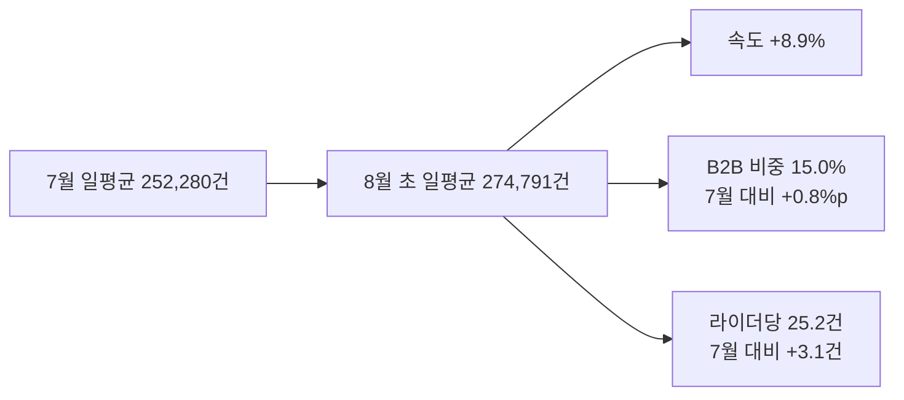
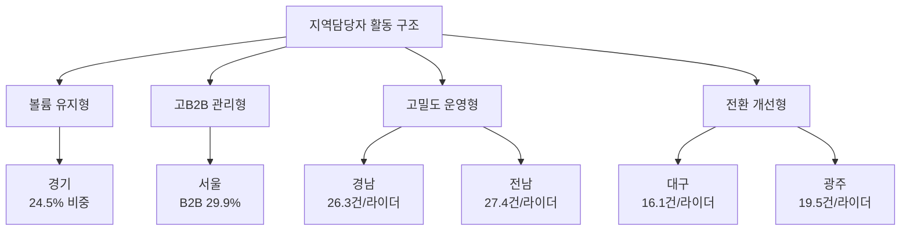

Creator: member-delta
Created: 2026-08-05 13:16
Version: 1.0

# 시각자료 개요

- 목적: 최근 현장 영업활동이 `얼마나 빠르게 출발했는지`와 `어떤 권역을 어떤 방식으로 관리해야 하는지`를 한눈에 보이게 한다.
- 입력 근거: `member-alpha/analysis-report.md`
- 주의: 권역 집계 기반 시각화이며, 개별 지역담당자 개인 로그를 나타내지 않는다.

# Mermaid 다이어그램

전국 최근 활동이 7월 평균 대비 어떤 방향으로 변했는지 요약

권역별 관리 유형과 우선 과제 분류

# 핵심 수치 테이블

| 지표 | 2026-07 월간 | 2026-08-01~04 | 변화 | 해석 |
|---|---:|---:|---:|---|
| 일평균 처리량 | 252,280건 | 274,791건 | +8.9% | 월초 출발 속도 상승 |
| B2B 비중 | 14.2% | 15.0% | +0.8%p | 영업 복잡도 상승 |
| 라이더당 처리량 | 22.1건 | 25.2건 | +3.1건 | 운영 밀도 상승 |
| 상위 5개 권역 비중 | 63.0% | 63.5% | +0.5%p | 대형 권역 집중 구조 유지 |

| 권역 | 현재 비중 | B2B 비중(7월 -> 현재) | 라이더당 처리량(7월 -> 현재) | 관리 해석 |
|---|---:|---:|---:|---|
| 경기 | 24.5% | 17.4% -> 18.7% | 21.6건 -> 24.6건 | 최대 권역, 유지와 대형계정 안정화 |
| 경남 | 14.4% | 9.3% -> 9.6% | 23.1건 -> 26.3건 | 고밀도 운영형 |
| 서울 | 9.3% | 28.0% -> 29.9% | 20.9건 -> 23.8건 | 고B2B 관리형 |
| 전남 | 8.2% | 12.4% -> 12.6% | 24.4건 -> 27.4건 | 고밀도 운영형 |
| 경북 | 7.1% | 7.1% -> 7.5% | 22.5건 -> 25.1건 | 중대형 안정권 |
| 대구 | 0.9% | 26.0% -> 31.1% | 15.4건 -> 16.1건 | 전환 개선형 |
| 광주 | 0.4% | 28.1% -> 29.9% | 16.1건 -> 19.5건 | 전환 개선형 |

| 영업 대상 유형 | 대표 권역 | 근거 지표 | 주요 특성 | 우선 관리 포인트 |
|---|---|---|---|---|
| 대형 유지형 | 경기 | 비중 `24.5%`, B2B `18.7%`, 라이더당 `24.6건` | 기존 대형 거래처와 안정화 대상 계정 비중이 큰 구조 | 유지율, 대형계정 안정화 |
| 고B2B 관리형 | 서울 | B2B `29.9%`, 라이더당 `23.8건` | 운영 조건이 복잡한 B2B 계정 비중이 높음 | 초기 활성화, 운영 조율 |
| 운영 전환형 | 경남, 전남 | 라이더당 `26.3건`, `27.4건` | 계약 이후 운영 전환이 빠른 계정군 비중이 높을 가능성 | 전환 루틴 표준화 |
| 전환 개선형 | 대구, 광주 | B2B `31.1%`, `29.9%` / 라이더당 `16.1건`, `19.5건` | 영업 확보 대비 운영 안착이 약한 계정군 | 반복주문 전환, 라이더 확보 |
