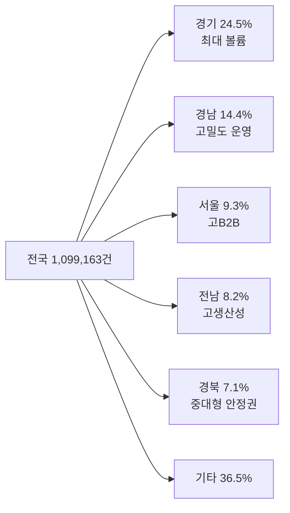

# 현장 지역담당자 최근 영업활동 분석

**작성일**: 2026-08-05
**Task Type**: research-report
**활성 멤버**: alpha(조사) · gamma(팩트체크) · delta(시각화) · beta(보고서)
**사이클**: 1 / 3
**승인**: human_approval=false (AUTO 모드 자동 완료, dashboard override 비활성)

## 요약

- 현장 대시보드 최근 누적 기준 전국 활동은 `1,099,163건`, B2B 비중은 `15.0%`, 라이더 1인당 처리량은 `25.2건`이다.
- 이번 보고서는 담당자 개인 로그가 아닌 `권역별 물량·B2B 믹스·라이더 밀도`를 지역담당자 최근 영업활동의 프록시 지표로 해석했다.
- 상위 5개 권역(`경기`, `경남`, `서울`, `전남`, `경북`)이 전체의 `63.5%`를 차지하므로, 실제 관리 난이도와 영향력은 대형 권역에 집중돼 있다.
- `경기`는 최대 볼륨 유지형, `서울`은 고B2B 관리형, `대구·광주`는 저생산성 전환개선형으로 읽힌다.

## 핵심 지표

| 항목 | 값 | 해석 |
|---|---:|---|
| 전국 전체 건수 | 1,099,163건 | 최근 누적 활동 규모 |
| C2C 비중 | 85.0% | 기본 물량축 |
| B2B 비중 | 15.0% | 영업 복잡도 축 |
| 라이더 1인당 처리량 | 25.2건 | 운영 밀도 프록시 |
| 상위 5개 권역 비중 | 63.5% | 대형 권역 집중 구조 |
| 최대 권역 | 경기 269,019건 | 전국의 24.5% |
| 최고 B2B 비중 대형 권역 | 서울 29.9% | 규모 대비 복잡도 높음 |
| 저생산성 고B2B 권역 | 대구 16.1건, 광주 19.5건 | 계약 후 전환 병목 의심 |
| 데이터 한계 | 전월 전국 비교 실패 | `502 redash timeout` |

## 핵심 인사이트

### 1. 지역담당자 영향력은 소수 대형 권역에 집중된다

- `경기`, `경남`, `서울`, `전남`, `경북` 5개 권역이 전체의 `63.5%`를 차지한다.
- 특히 `경기`는 `269,019건`으로 단독 `24.5%`를 차지해, 이 권역 담당자의 활동 품질이 전국 흐름에 미치는 영향이 가장 크다.
- 따라서 대형 권역 담당자는 신규 수주량보다 `기존 거래처 유지`, `초기 운영 흔들림 억제`, `대형 B2B 계정 안정화`에 더 많은 시간을 투입하고 있을 가능성이 높다.

### 2. 서울은 고B2B 관리형 권역이다

- `서울`은 전체 건수 `102,451건`, B2B `30,663건`, B2B 비중 `29.9%`다.
- 같은 기간 라이더 1인당 처리량은 `23.8건`으로 전국 평균 `25.2건`보다 낮다.
- 이 조합은 서울 담당자의 최근 활동이 단순 계약 확대보다 `복잡한 B2B 계정의 초기 안착과 운영 조율`에 더 많이 배분됐을 가능성을 시사한다.

### 3. 대구와 광주는 계약 이후 전환 개선이 필요한 신호다

- `대구`는 B2B 비중 `31.1%`, 라이더 1인당 처리량 `16.1건`이다.
- `광주`는 B2B 비중 `29.9%`, 라이더 1인당 처리량 `19.5건`이다.
- 두 권역 모두 B2B 비중은 높은데 운영 밀도는 낮아, 담당자 활동이 `계약 체결 이후 반복 주문 전환`까지 이어지지 못하고 있을 가능성이 있다.

### 4. 경남은 제한된 비교 범위에서 운영 밀도 개선이 관측된다

- 비교에 성공한 `경남`은 `2026-07` 전체월 기준 라이더 1인당 처리량 `23.1건`에서 현재 월초 스냅샷 `26.3건`으로 높아졌다.
- B2B 비중도 `9.3%`에서 `9.6%`로 소폭 상승했다.
- 전월 전국 비교가 실패해 일반화는 금지해야 하지만, 적어도 경남은 영업활동이 운영 밀도로 연결되는 긍정 신호를 보인다.

## 시각 요약

| 권역 유형 | 대표 지역 | 근거 지표 | 해석 |
|---|---|---|---|
| 최대 볼륨 유지형 | 경기 | 269,019건, 24.5% | 유지와 안정화 우선 |
| 고B2B 관리형 | 서울 | B2B 29.9%, 23.8건/라이더 | 복잡한 계정 운영 비중 큼 |
| 고밀도 운영형 | 경남, 전남 | 26.3건, 27.4건/라이더 | 운영 전환 양호 |
| 전환 개선형 | 대구, 광주 | 16.1건, 19.5건/라이더 | 계약 후 활성화 병목 가능 |

## 추천 사항

1. `경기`와 `서울`을 별도 관리 트랙으로 분리한다.
2. `경기`는 `기존 대형 계정 유지율`과 `운영 이탈 방지`를 우선 KPI로 둔다.
3. `서울`은 `B2B 계정별 초기 활성화율`과 `첫 반복 주문 전환 속도`를 다음 확인 KPI로 둔다.
4. `대구`와 `광주`는 계약 후 2주 내 `활성화 여부`, `라이더 확보`, `반복 주문 전환`을 점검하는 개선 리스트를 운영한다.
5. `전남`과 `경남`의 높은 처리 밀도 운영 루틴을 표준사례 후보로 수집해 저생산성 권역에 이식한다.
6. 다음 사이클에는 `담당자별 파이프라인 로그`와 `계정 활성화 로그`를 연결해 현재 프록시 분석을 실제 담당자 성과 분석으로 확장한다.
