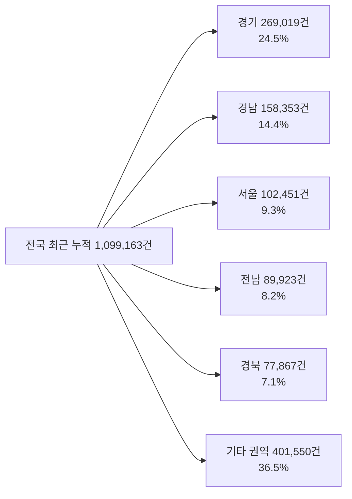
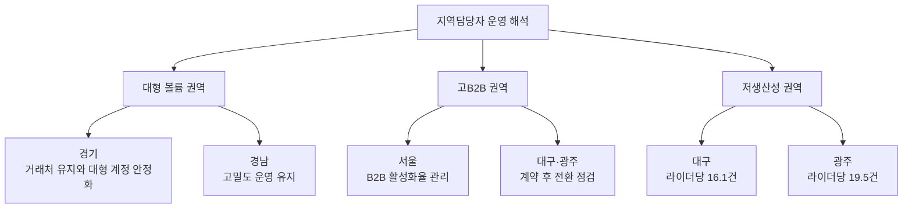

Creator: member-delta
Created: 2026-08-05 12:55
Version: 1.0

# 시각자료 개요

- 목적: 지역담당자가 `어디를 먼저 볼지`, `무엇을 어떤 유형으로 관리할지`를 빠르게 읽도록 현장 대시보드 수치를 구조화한다.
- 시각화 범위: 전국 최근 누적 스냅샷, 상위 권역 집중도, 고B2B 권역과 저생산성 권역의 우선 조치 포인트
- 주의: 개별 담당자 로그가 아니라 지역 집계 기반 시각화다.

# Mermaid 다이어그램

상위 권역이 전체 활동의 대부분을 차지하는 구조

권역별 관리 방식의 우선순위

# 핵심 수치 테이블

| 구분 | 전체 건수 | 비중 | B2B 비중 | 라이더당 처리량 | 해석 포인트 |
|---|---:|---:|---:|---:|---|
| 전국 | 1,099,163 | 100.0% | 15.0% | 25.2건 | 최근 4일 누적 기준 월초 강도 높음 |
| 경기 | 269,019 | 24.5% | 18.7% | 24.6건 | 최대 권역, 유지와 안정화 우선 |
| 경남 | 158,353 | 14.4% | 9.6% | 26.3건 | 대형 권역 중 생산성 양호 |
| 서울 | 102,451 | 9.3% | 29.9% | 23.8건 | 고B2B, 복잡도 높은 권역 |
| 전남 | 89,923 | 8.2% | 12.6% | 27.4건 | 생산성 우수, C2C 기반 안정화 |
| 경북 | 77,867 | 7.1% | 7.5% | 25.1건 | 중대형 권역, C2C 비중 높음 |
| 대구 | 9,968 | 0.9% | 31.1% | 16.1건 | 고B2B 대비 전환 효율 낮음 |
| 광주 | 4,216 | 0.4% | 29.9% | 19.5건 | 고B2B 대비 규모 작고 밀도 낮음 |

| 브랜드 | 전체 건수 | 비중 | B2B 비중 | 라이더당 처리량 | 비고 |
|---|---:|---:|---:|---:|---|
| 바로고 | 629,107 | 57.2% | 19.2% | 25.2건 | 볼륨과 B2B 부담이 가장 큼 |
| 딜버 | 270,864 | 24.6% | 8.4% | 26.8건 | 상대적으로 고밀도 운영 |
| 모아라인 | 194,901 | 17.7% | 8.6% | 26.7건 | 고밀도 운영 참고 축 |
| 브랜드 합계 차이 | 4,291 | 0.4%p 미만 | - | - | 전국 총계와 미세한 집계 차이 존재 |

| 경남 비교 | 2026-07 | 2026-08-01~04 | 변화 | 해석 |
|---|---:|---:|---:|---|
| 전체 건수 | 1,113,326 | 158,353 | 참고 | 전월 전체월 대비 현재 월초 스냅샷 |
| B2B 비중 | 9.3% | 9.6% | +0.3%p | B2B 믹스 소폭 상승 |
| 라이더당 처리량 | 23.1건 | 26.3건 | +3.3건 | 운영 밀도 상승 신호 |
