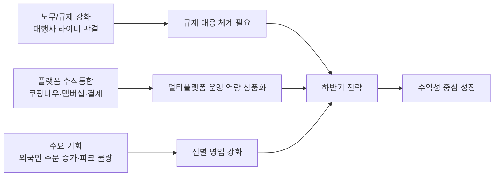

# 현재 시장 현황 및 내부 실적 기반 2026년 하반기 전략 보고서
**작성일**: 2026-08-14
**Task Type**: research-report
**활성 멤버**: alpha(조사) · gamma(팩트체크) · delta(시각화) · beta(보고서)
**사이클**: 1 / 3
**승인**: human_approval=false (AUTO 모드 자동 완료, ERP/market 대시보드 사용·override 비활성)

Creator: team-lead
Created: 2026-08-14
Version: v1

## 요약

현재 시장은 바로고에게 `성장 기회`와 `사업모델 리스크`를 동시에 만들고 있다. 외부에서는 배달대행 라이더 근로자성 판결 `[확인됨, 전자신문 2026-07-08]`, 쿠팡이츠의 `쿠팡나우` 재도전 `[확인됨, 더구루 2026-07-12]`, 배달앱 규제 심화와 표준연동 확산 `[확인됨, market W31/W32]`이 이어지고 있다. 내부에서는 2026년 상반기 매출 `[확인됨] -20.6%`, 수행건수 `[확인됨] -22.1%` 감소에도 영업손실 `[확인됨] 40.1%`, EBITDA 손실 `[확인됨] 51.5%` 개선이 확인됐다.

이 조합은 하반기 전략을 `외형 회복을 위한 전면 확장`보다 `수익성 있는 물량 중심의 선별 성장`으로 가져가야 함을 시사한다 `[추정]`. 즉, 바로고는 하반기에 `1)` B2B/SLA 중심의 영업 재정렬, `2)` 라이더 규제·노무 대응 체계 구축, `3)` 퀵커머스·외국인 주문 증가를 겨냥한 선택형 성장 패키지 출시를 우선순위로 삼는 것이 적절하다 `[추정]`.

## 핵심 인사이트

### 1. 시장 위험의 무게중심이 배달앱에서 배달대행사로 이동했다

- 배달 대행사 라이더 근로자성 첫 인정 판결은 `[확인됨, 전자신문 2026-07-08]`이다.
- market W32는 상고 포기까지 반영해 이 흐름을 배달대행 업계 직접 리스크로 정리한다 `[확인됨, market W32]`.
- 따라서 하반기에는 `시장 점유율`보다 `계약 구조`, `운영 기준`, `손익 충격 시나리오`를 먼저 정리해야 할 가능성이 높다 `[추정]`.

### 2. 플랫폼 경쟁은 점유율보다 수직통합과 표준 경쟁으로 이동 중이다

- 쿠팡이츠의 `쿠팡나우` 재도전은 `[확인됨, 더구루 2026-07-12]`이며, 퀵커머스 물류 내재화 압력이 더 커질 수 있다 `[추정]`.
- market W31은 우버-DH 심사 쟁점을 멤버십·데이터·결제 연계로 정리한다 `[확인됨, market W31]`.
- market W32는 배민이 바로고 포함 `[확인됨] 6개` 배달대행사와 위치추적 표준연동을 완료했다고 설명한다 `[확인됨, market W32]`.
- 이 변화는 바로고에게 `플랫폼 종속 압력`이면서 동시에 `검증된 표준 운영 파트너`라는 영업 근거이기도 하다 `[추정]`.

### 3. 내부 실적은 외형 둔화 속 수익성 개선이라는 상반된 신호를 준다

- ERP 상반기 누적 기준, 매출은 `[확인됨] 1,395.8억원 -> 1,107.7억원`, `[확인됨] -20.6%` 감소했다.
- 수행건수는 `[확인됨] 6,660만건 -> 5,185만건`, `[확인됨] -22.1%` 감소했다.
- 영업손실은 `[확인됨] 40.1%`, EBITDA 손실은 `[확인됨] 51.5%` 개선됐다.
- B2B 비중은 `[확인됨] 11.3% -> 13.7%`로 높아졌다.
- 2026년 6월 EBITDA는 `[확인됨] 약 0.15억원` 흑자였고, 이를 비용 구조 개선 진행 신호로 볼 수 있다 `[추정]`.
- 다만 ERP `[확인됨] 2026-Q3`, `[확인됨] 2026-07`, `[확인됨] 2026-08`의 매출/원가가 `[확인됨] 0`으로 조회돼 미마감 또는 부분 집계일 가능성이 높으므로 `[추정]`, 확정 실적 판단에는 쓰지 않았다.

### 참고 시각자료



아래 우선순위 좌표값은 `즉시성`과 `손익 영향`을 0~1 범위로 상대 평가한 `[추정]` 배치다.

```mermaid
quadrantChart
    title 하반기 전략 우선순위
    x-axis 낮은 즉시성 --> 높은 즉시성
    y-axis 낮은 손익 영향 --> 높은 손익 영향
    quadrant-1 바로 실행
    quadrant-2 선행 투자
    quadrant-3 보류 가능
    quadrant-4 모니터링
    라이더 규제 시나리오(추정): [0.90, 0.95]
    B2B/SLA 선별 영업(추정): [0.82, 0.90]
    외국인/퀵커머스 제안서(추정): [0.72, 0.62]
    전면 볼륨 확장(추정): [0.30, 0.40]
```

| 구분 | 수치 | 의미 |
|---|---:|---|
| 2026-H1 매출 YoY | `[확인됨] -20.6%` | 외형 회복보다 선택적 성장 우선 `[추정]` |
| 2026-H1 수행건수 YoY | `[확인됨] -22.1%` | 물량 감소 지속 `[확인됨]` |
| 2026-H1 영업손실 개선 | `[확인됨] 40.1%` | 손익 체력 개선 `[추정]` |
| 2026-H1 EBITDA 손실 개선 | `[확인됨] 51.5%` | 운영 효율 개선 가시화 `[추정]` |
| B2B 비중 | `[확인됨] 11.3% -> 13.7%` | 믹스 개선 가능성 `[추정]` |
| 외국인 주문 증가 | `[확인됨, 매일경제 2026-07-12] +331%` | 관광/야식 피크 수요 기회 `[추정]` |
| 치킨 주문 증가 | `[확인됨, 매일경제 2026-07-12] +281%` | 카테고리별 운영 최적화 필요 `[추정]` |
| 표준연동 참여 | `[확인됨, market W32] 6개사` | 플랫폼 표준 경쟁 현실화 `[추정]` |

## 추천 사항

### 1. B2B/SLA 중심 선별 영업 체계로 전환

- 왜 지금: 상반기 매출 `[확인됨] -20.6%`, 수행건수 `[확인됨] -22.1%` 감소에도 손익은 개선됐다. 이 조합은 무리한 외형 확대보다 `수익성 높은 물량 확보`가 우선이라는 신호다 `[추정]`.
- 무엇을 할지:
  - B2B 비중이 높거나 확대 가능한 거래처를 우선 타깃으로 재정렬
  - `도착 정시율`, `배차 성공률`, `재배차율` 기준으로 SLA 중심 제안서 표준화
  - 적자 유발 거래처와 카테고리를 재분류해 유지/축소 기준 설정
- 성공 판단 기준:
  - Q4까지 B2B 비중 `15% 이상` `[추정]`
  - Q4 EBITDA 손실을 `2026-Q2 EBITDA 손실 [확인됨] -0.8억원`보다 낮은 수준으로 축소 `[추정]`
  - SLA 기준 관리 거래처 비중 `60% 이상` `[추정]`

### 2. 라이더 규제/노무 시나리오 대응 태스크포스 즉시 가동

- 왜 지금: 배달대행사 라이더 판결은 `[확인됨]`이며, 바로고와 같은 사업구조의 리스크를 먼저 점검해야 한다 `[추정]`.
- 무엇을 할지:
  - 법무·재무 공동으로 `최소/기준/최악` 3개 비용 시나리오 작성
  - 현재 계약서와 운영 프로세스 중 분쟁 가능 조항 식별
  - 우선 수정 가능한 항목을 30일 단위 액션으로 쪼개 실행
- 성공 판단 기준:
  - 30일 내 `3개 비용 시나리오` 완료 `[추정]`
  - 핵심 계약/운영 조항 `10개 이내` 우선수정 리스트 도출 `[추정]`
  - 경영진 월별 점검 체계 가동 `[추정]`

### 3. 퀵커머스·외국인 수요를 겨냥한 선택형 성장 패키지 출시

- 왜 지금: 외국인 주문 증가 `[확인됨, 매일경제 2026-07-12]`와 쿠팡나우 재도전 `[확인됨, 더구루 2026-07-12]`은 특정 카테고리·거점에서 추가 물량 기회를 만들 수 있다 `[추정]`.
- 무엇을 할지:
  - 외국인 주문 수요가 큰 야식/치킨 거점 중심 운영 패키지 제안
  - 퀵커머스 피크 대응 전담 운영 모델 제안서 제작
  - `[추정] 배달앱 이용료 상승 대비 운영 안정성` 메시지를 포함한 비용 방어형 영업 자료 제작
- 성공 판단 기준:
  - 9월 말까지 신규 제안서 `10건 이상` 발송 `[추정]`
  - 파일럿 거점 `3곳 이상` 확보 `[추정]`
  - 대상 카테고리 피크 시간 물량 전분기 대비 `5% 이상` 증가 `[추정]`

## 출처 메모

- ERP 사업실적: `http://10.10.190.25:8000/api/external/business-performance?period=quarter&from=2025-Q1`
- ERP 월별 실적: `http://10.10.190.25:8000/api/external/business-performance?period=month&from=2026-01`
- market W29: `https://barogo-intel.vercel.app/api/report?week=2026-W29&locale=kr`
- market W30: `https://barogo-intel.vercel.app/api/report?week=2026-W30&locale=kr`
- market W31: `https://barogo-intel.vercel.app/api/report?week=2026-W31&locale=kr`
- market W32: `https://barogo-intel.vercel.app/api/report?week=2026-W32&locale=kr`
- 전자신문 기사: `https://n.news.naver.com/mnews/article/030/0003445866?sid=101`
- 매일경제 기사: `https://n.news.naver.com/mnews/article/009/0005706130?sid=103`
- 더구루 기사: `https://www.theguru.co.kr/news/article.html?no=104189`
