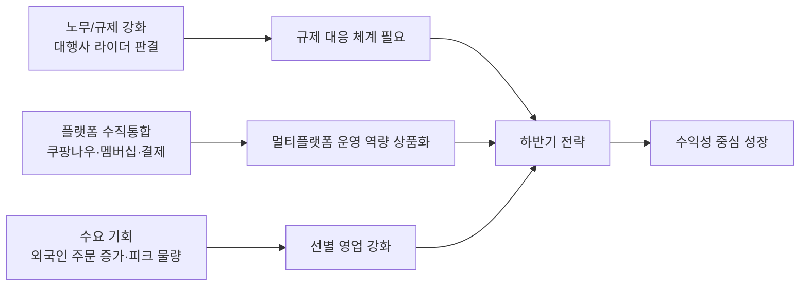

# 하반기 전략 시각자료

Creator: member-delta
Created: 2026-08-14
Version: v2

## 시각자료 개요

- 목적: 외부 시장 압력과 내부 실적 추세, 전략 우선순위를 한 화면에서 이해할 수 있게 요약한다.
- 사용 데이터:
  - ERP 사업실적 `[확인됨] 2025-H1`, `[확인됨] 2026-H1`, `[확인됨] 2026-Q1`, `[확인됨] 2026-Q2`
  - market 리포트 `[확인됨] W29~W32`
  - 언론 기사 원문 `[확인됨] 3건`
- 표현 원칙:
  - ERP와 언론 기사 원문 수치는 `[확인됨]`으로 표기한다.
  - 사내 market 리포트 기반 문구는 `[확인됨] 사내 리포트 기준`으로 표기한다.
  - 우선순위 좌표와 시사점 배치는 전략 판단용 `[추정]`이다.

## Mermaid 다이어그램

시장 변화와 내부 대응의 연결 구조.



실적과 전략 우선순위의 관계.

아래 좌표값은 `즉시성`과 `손익 영향`을 0~1 범위로 상대 평가한 `[추정]` 배치다.

```mermaid
quadrantChart
    title 하반기 전략 우선순위
    x-axis 낮은 즉시성 --> 높은 즉시성
    y-axis 낮은 손익 영향 --> 높은 손익 영향
    quadrant-1 바로 실행
    quadrant-2 선행 투자
    quadrant-3 보류 가능
    quadrant-4 모니터링
    라이더 규제 시나리오(추정): [0.90, 0.95]
    B2B/SLA 선별 영업(추정): [0.82, 0.90]
    외국인/퀵커머스 제안서(추정): [0.72, 0.62]
    전면 볼륨 확장(추정): [0.30, 0.40]
```

## 핵심 수치 테이블

| 구분 | 수치 | 해석 |
|---|---:|---|
| 2026-H1 매출 YoY | `[확인됨] -20.6%` | 외형 회복보다 선택적 성장 필요 `[추정]` |
| 2026-H1 수행건수 YoY | `[확인됨] -22.1%` | 저수익 물량 축소 영향 가능성 `[추정]` |
| 2026-H1 영업손실 개선 | `[확인됨] 40.1%` | 손익 체력은 개선 중 `[추정]` |
| 2026-H1 EBITDA 손실 개선 | `[확인됨] 51.5%` | 운영 효율 개선 가시화 `[추정]` |
| 2026-Q2 매출 QoQ | `[확인됨] -8.3%` | 2분기 외형 둔화 지속 `[확인됨]` |
| 2026-Q2 EBITDA 손실 개선 | `[확인됨] 67.6%` | 비용 통제 효과 뚜렷 `[추정]` |
| B2B 비중 | `[확인됨] 11.3% -> 13.7%` | 믹스 개선 가능성 `[추정]` |
| 외국인 주문 증가 | `[확인됨] +331%` | 관광/야식 피크 수요 기회 `[추정]` |
| 치킨 주문 증가 | `[확인됨] +281%` | 카테고리별 운영 최적화 필요 `[추정]` |
| 쿠팡나우 재도전 | `[확인됨] 기사 원문 확인` | 퀵커머스 경쟁 심화 `[추정]` |
| 대행사 라이더 근로자성 판결 | `[확인됨] 기사 원문 확인` | 노무 리스크 직접화 `[추정]` |
